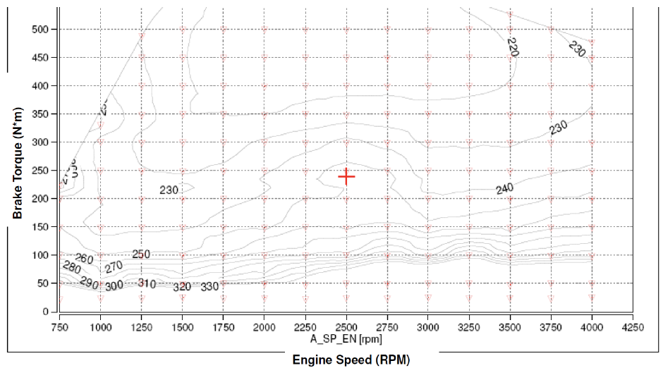
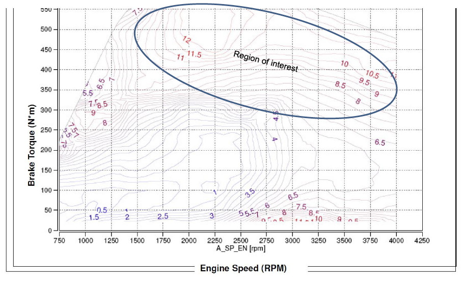
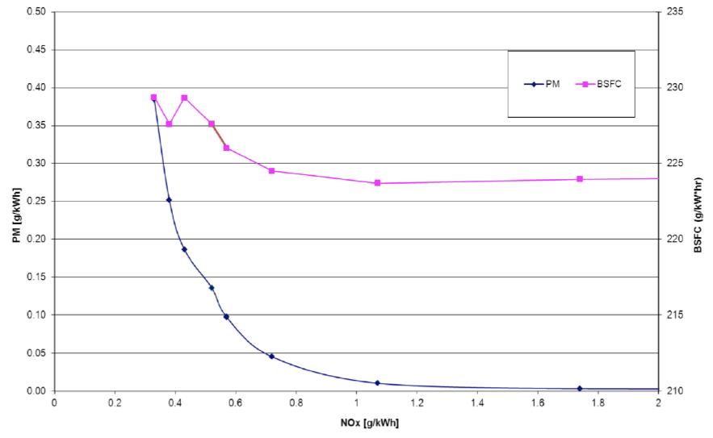
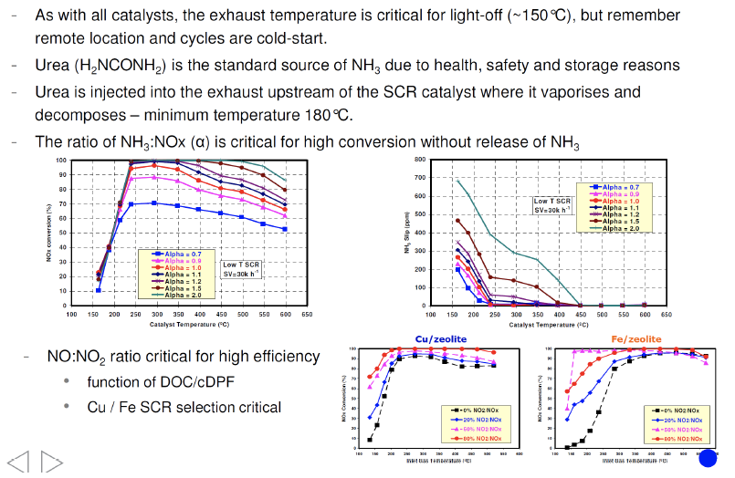

## Coursework Assignment 3: Investigating Engine Emissions (70%)

One of a range of diesel powered cars is currently under review of new European emissions requirements.  Management are interested to know the capability of the technology to support further reduction in NOx emissions without influencing other regulated emissions (particularly PM and PN) and fuel economy more than 1% BSFC. The challenge is high load conditions (across the speed range) which engineering management believes can be improved. Drivability meets all the requirements and must be maintained through any of the proposed changes.

You have been asked to specify a project to complete a study where the scope for improvement will be examined in detail.  Some changes to the control strategy could be considered. They include:

- Fuel rail pressure strategy.
- The use of a modified pulse pattern in fuel injection.
- The addition of an SCR emissions reduction system.

All of these technology choices are available and proven, your task is to assess the calibration implications. All will come at a cost and the priority order for those items needs to be understood.

The engine is of a normal configuration with high pressure common rail (HPCR), a variable geometry turbocharger (VGT), cooled EGR, piezo injectors and the recently added eTurbo.

The steps of the project are as follows:

- Draft a set of project objectives.
- Identify the weaknesses in the currents engine’s performance expanding on what is identified above.
- Set out an experiment plan (using DOE principles) to explore the current engine in its as-received condition and investigate the trade off between fuel consumption and NOx emissions in response to the controllable variables.
- Devise a new experiment plan to identify the contribution that can be made by the new controls and the addition of SCR emissions reduction system.
- Identify the calibration issues that are raised by the use of SCR.
- Consider the risks inherent in the experiment plan – both technical and timescale and how you will take steps to mitigate the risks.

### Submission Requirements

You will draft a report addressed to your Chief Engineer that sets out a plan according to the requirements above, the report should include the following main sections:

- An introduction explaining the background to the project.
- A summary of the approach that you will adopt.
- An analysis of the behaviour of the existing engine (using the supplied data) and a reasoned explanation of the current engine behaviour.
- A qualitative analysis of the control features commenting on their likely effect and whether any other new control features should be considered (screening experiments).
- An overview of the experiment plan to identify the relative significance of the new controlled variables and SCR system (screening and sensitivity experiments).  In doing this you should propose experiments, as part of the screening, that are able to identify the relative importance of each of the technologies in achieving the stated objectives.
- A description of the optimisation process to generate an optimal calibration.
  
The report should be no more than 10 pages in length including any appendices.

### Assessment

The report will be marked according to the following scheme with marks split between Technical, Report / Writing Style and Presentation.  Some guidance is provided below as to how the marks will be allocated.

#### Technical (65%)

The facts stated are correct and relevant.  Correct statements are made about the technology and methodology proposed. The proposal considers the control changes and technologies outlined in the brief against likely implications for calibration of the control system.

All of the “steps of the project” as outlined in the coursework brief have been considered within the report.

The proposed plan draws on evidence presented within the report and by way of reference to other sources of information that are appropriately cited. A minimum of five external sources of information (excluding course notes/slides) are included.  The sources are used in a meaningful way in the report to support the decisions made and/or provide a background/further information on the topics discussed.

#### Report / writing style (20%)

The style of the report and writing is appropriate for a technical document (see the guidance provided by this document on [Report Writing](https://www.lboro.ac.uk/media/wwwlboroacuk/content/library/downloads/advicesheets/Report%20writing.pdf) and includes the topics as outlined within the coursework brief.

The way in which the report is written is convincing and includes the necessary information to provide a convincing argument for the experimental approach as would be judged by a person reasonably familiar with the topic.

#### Presentation (15%)

The structure of the report is well considered and includes the necessary headings and sections. Figures that are included are laid out well and include a label and introduction before they appear in the text.  The font style and size is appropriate.  The report presentation overall is appropriate and figures are labelled. Plots include a title and axis labels as well as units (where appropriate). The report is an appropriate length (no more than 10% longer than the page limit).

## Additional Information

The following data has been provided to help set the context for the exercise.  Please consider that this is a small fraction of the data typically generated during a calibration exercise.  

### Typical BSFC (g/kWh) Map versus Engine Speed (rpm) and Brake Torque (Nm)

### Typical BSNOx (g/kWh) map against Engine Speed (rpm) and Brake Torque (Nm)

### Typical EGR NOx/Particulate Trade-off Curve, 1500 rpm, 130Nm Brake Torque (all units g/kWh)

### Data illustrating SCR performance

