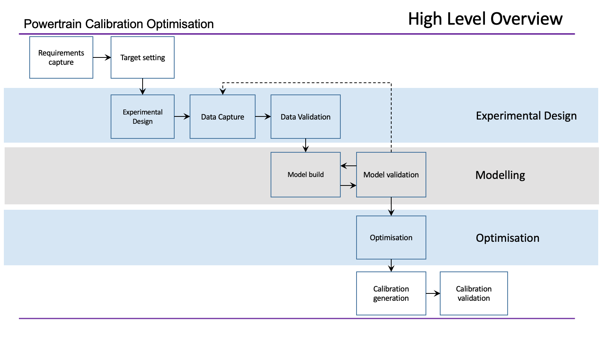

# Overview

## Week 1

The first part of the lecture for this week introduces the module and the assessment structure. In the second part we will look at what calibration is.

As more technology is added to vehicles the complexity of the control system increases significantly. Powertrain controllers may have up to 50,000 parameters. Typically, up to 5000 of these may be changed to influence performance in terms of drivability, emissions and energy consumption. Calibration is the process by which information is obtained and decisions made to change parameter values to improve performance.  In this first session we will be looking at, in overview, the various parts of the process and how these fit together to help engineers achieve optimal hardware performance. As we will see regardless of the powertrain technology, the process remains largely the same containing elements of optimisation, design of experiments, mathematical modelling and experimentation.

### Week 1 Resources

| **Lecture Slides**  |
| [Introduction]({{ site.url }}/ttp451-module/lectures/L1_introduction.pdf) |

## Week 2

At the core of the calibration process is the requirement to specify experiments, execute them to obtain data and create mathematical models based on this data. This could include emissions control systems, electric motors, engines, etc. These mathematical models are then used within a search algorithm or optimisation routine to find calibration parameter values that achieve best performance.

Underpinning all of the mathematical modelling is fundamental statistics that helps specify experiments, interpret results and create mathematical models. This week we will be looking at reviewing some fundamental statistical principles as we begin to consider these topics.

### Week 2 Resources

| **Lecture Slides**  |
|[Statistics]({{ site.url }}/ttp451-module/lectures/L2_statistics.pdf) |

| **Tutorial and Computer Labs** |
| [MATLAB Onramp](https://uk.mathworks.com/learn/tutorials/matlab-onramp.html) |
| [Simulink Onramp](https://uk.mathworks.com/learn/tutorials/simulink-onramp.html) |

## Week 3

The optimisation process is typically used to find actuator settings and controller gains that achieve the objectives of the calibration task. These may be, for example, minimum levels of noise or emissions. The model is used during optimisation as an inexpensive means of evaluating the consequence of changing actuator settings or controller gains on the outputs that relate to the calibration objectives. Without this systematic mathematical search, finding an acceptable solution for a high dimensional system would be almost impossible.

This week we will be looking at the fundamentals of the optimisation task to understand how we formulate the calibration task as an optimisation problem. This includes the lecture and a set of laboratory exercises completed this week and next. Later in the course, we will put this knowledge to use within a calibration exercise.

### Week 3 Resources

| **Lecture Slides**  |
|[Optimisation]({{ site.url }}/ttp451-module/lectures/L3_optimisation.pdf) |

| **Computer Labs** |
| [Optimisation Laboratory]({{ site.url }}/ttp451-module/labs/Lab_1.html) |

## Week 4

Models used within the calibration process (static or dynamic) require high levels of accuracy, due to this empirical models are used. These are built using a mathematical structure that is adjusted by comparing the model with data.

The collection of data in high dimensional systems is both expensive and time consuming.  Design of experiments ensures that the experiments used for data collection are as efficient as possible collecting only the required data and no more.  

This week we will look at the fundamentals of experimental design and how it can be deployed for use in data collection. Whilst the context in which we discuss this is powertrain calibration, experimental design methods, can be used wherever experimentation is undertaken.  In fact it all started with a cup of tea.

<iframe width="560" height="315" src="https://www.youtube.com/embed/lgs7d5saFFc" title="YouTube video player" frameborder="0" allow="accelerometer; autoplay; clipboard-write; encrypted-media; gyroscope; picture-in-picture" allowfullscreen></iframe>

### Week 4 Resources

| **Lecture Slides**  |
| [Design of Experiments]({{ site.url }}/ttp451-module/lectures/L4_design_of_experiments.pdf) |

| **Computer Labs** |
| [Design of Experiments]({{ site.url }}/ttp451-module/labs/Lab_2.html) |
