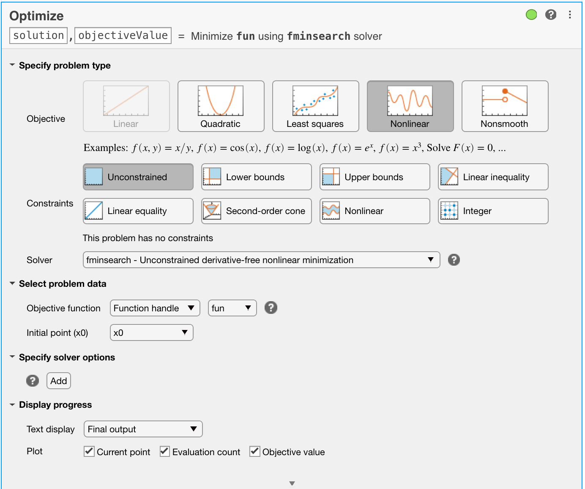
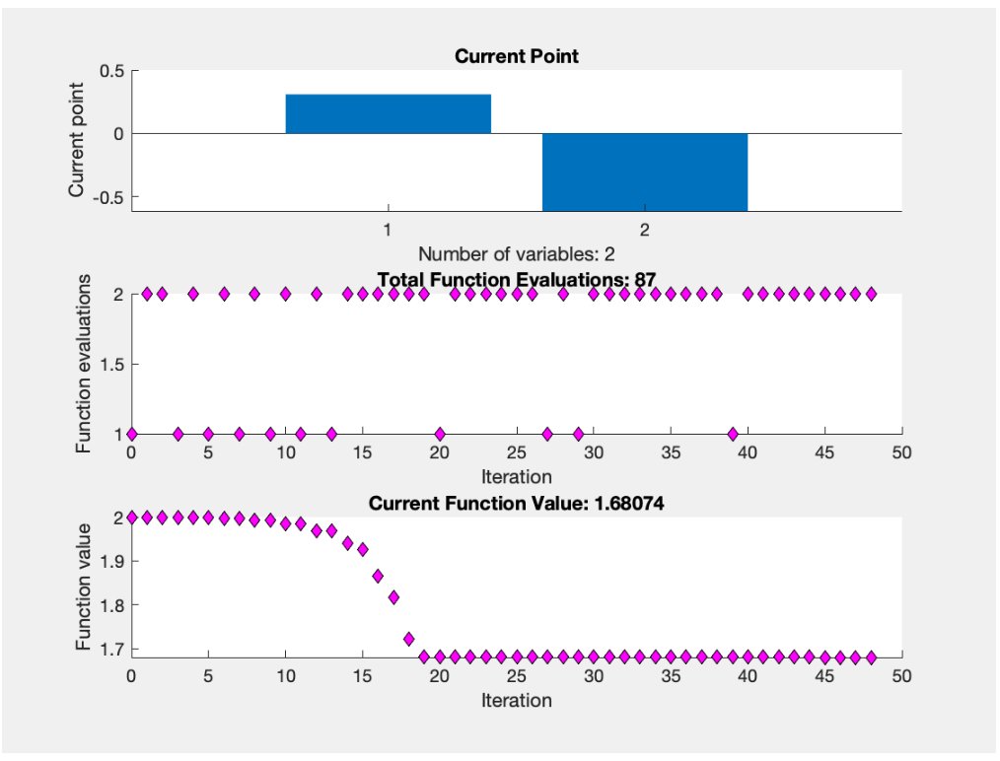

# Lab 1: Optimisation
{: .no_toc }

<details close markdown="block">
  <summary>
    Table of contents
  </summary>
  {: .text-delta }
1. TOC
{:toc}
</details>

## Topics
{: .no_toc }

- Aims and Objectives
- Overview and Exercise
- Background Information
- Exercise 1: Optimisation

## Learning Outcomes
{: .no_toc }

By the end of this lesson, you will be able to:

- Evaluate and visualise a cost function.
- Use different solvers in MATLAB&copy; to solve optimisation problems.
- Solve real world optimisation problems relating to powertrains.

## Aims and Objectives

The aim of this exercise is to gain an understanding of basic optimisation approaches, this will be evaluated in the setting of mathematics and engine operation.

## Overview of Exercise

The optimisation problem is an abstraction of the problem of making the best possible choices from a set of candidate choices. This includes the representation of the choice made, the constraints (specifications or limits) and the objective function (representing the cost of making a specific choice). The solution of the optimisation problem is the choice that has the **minimum cost** among all choices that meet the requirements.

## Background Information

The MATLAB&copy; Optimisation Toolbox provides functions for finding parameters that minimize or maximize objectives while satisfying constraints. The toolbox includes solvers for linear programming, mixed-integer linear programming, quadratic programming, nonlinear optimisation and nonlinear least squares. You can use these solvers to find optimal solutions to continuous and discrete problems, perform trade-off analyses and incorporate optimisation methods into algorithms and applications. We will use the optimisation GUI as well as code.

---

### Exercise 1: Optimisation

Download the data for this exercise [here]({{ site.url }}/ttp451-module/files/Exercise_1.zip)

---

#### Task 1-1: Basics of Optimisation

The file **J1.m** implements the following nicely shaped cost function:

$$J_1(p)=p^2_1+e^{p_2}+e^{-p_2}+p_1p_2+p_2$$

as a function;

```matlab
function [cost] = J1(p1,p2)
cost = p1.^2 + exp(p2) + exp(-p2) + p1 .* p2 + p2;
```

in MATLAB&copy;.

- Evaluate $$J_1$$ for a number of points and try to get a feeling for it, you can use a simple call with two arguments such as ``<J1(arg1,arg2)>``.
- Visualise this function. The *ez* plot functions are convenient to do this, such as ``<ezsurf(@J1)>`` or ``<ezcontour(@J1)>``. Which kind of plot is most suitable?

  

- Use ``<fminsearch(fun, x0)>`` to find the minimum starting the search from ``x0 = [0,0]``: ``<fminsearch(@J1vect,[0, 0])>``. The ``<fminsearch>`` expects a function with a single vector argument therefore the version defined in **J1vect.m** has to be used. Try different starting points.
- How many evaluations of $$J$$ are required by ``<fminsearch>``?

---

#### Task 1-2: Optimtool GUI

The same exercise can be achieved using the graphical interface, which presents more information about the optimisation process.

- Open up the MATLAB&copy; LiveScript **GetStartedWithOptimizeLiveEditorTaskExample1.mlx** from the files downloaded. This is a generic script so will need to be changed slightly as follows.
- Familiarise yourself with the script in particular the *Optimise* task.
- Enter the starting point [0 0].
- Select *Unconstrained optimisation*.
- Select the solver ``<fminsearch>``.
- Enter the objective function ``<@J1vect>`` noting that there are a few different ways that this can be done.
- Ensure you have selected the plot options [Current point], [Evaluation count] and [Objective value]. Once you have completed making the changes, the task interface should look like the figure below.



- Under Plot Functions enable the options [Function Count] and [Function Value]. This shows how the function value decreases during the optimisation.
- Click [Run]. How long does it take and how many iterations are required? Your results should look like the figure shown below.



- Try the same with the solver ``<fminunc>``. What is the main difference between this and the previous solver?
- Try a constrained minimisation using the solver ``<fmincon>``. You have to supply bounds for $$p$$ such as Lower: $$[-10, -10]$$ and Upper: $$[10, 10]$$. What happens if you only allow positive values?

---

#### Task 1-3: Optimal Powertrain Calibration

The file **model_V8NA_V2.m** is a simple model of a naturally aspirated spark ignition V8 engine at a fixed engine speed. It takes a single vector argument with three values: the relative load (0 to 100), the spark advance angle (0 to 35) and the normalised air fuel ratio (0.8 to 1.1). The output is a vector of 6 measurements: BMEP (in bar), SD of BMEP (in bar), exhaust mass flow (in kg/h), exhaust temperature (in C), fuel consumption (in kg/h) and BSFC (in g/kWh).

- For a relative load of 50 and an Air-Fuel Ratio of 1, find the best BSFC. You can use unconstrained optimisation with ``<fminsearch>`` or constrained optimisation using ``<X = fmincon(FUN,X0,A,B)>`` for this. You will need to write your own cost function that calls the model function.
- A better formulation of this problem is to find the best BSFC for a given BMEP (6 bar as a good example), relative load and air fuel ratio.  Use the fixed values of 50 for relative load and 1 for air fuel ratio as in the last question.
- Repeat this optimisation for a number of steps from 1 bar to 10 bar BMEP. This will result in an optimal calibration but is it realistic? Which requirements have been ignored? How could you include them?

---

#### Task 1-4: Multicriteria Optimisation (optional)

Consider the following multicriteria cost function. It distinguishes between two stretches driven with different speeds $$p_1$$ and $$p_2$$;

$$J_4(p) = \alpha \frac{50}{p_1} + \alpha \frac{50}{p_2} + 5\frac{p_1}{60}^2 + 4\frac{p_2}{60}^2$$

- Plot the function above. Is it convex?
- Find the optimum for a set of hourly costs $$\alpha$$. You have to edit the function J4.m to change $$\alpha$$. (If you are a more advanced user of MATLAB&copy; you could automate this process).
- How can the results be visualised? Create a diagram with the key relationships.

---
