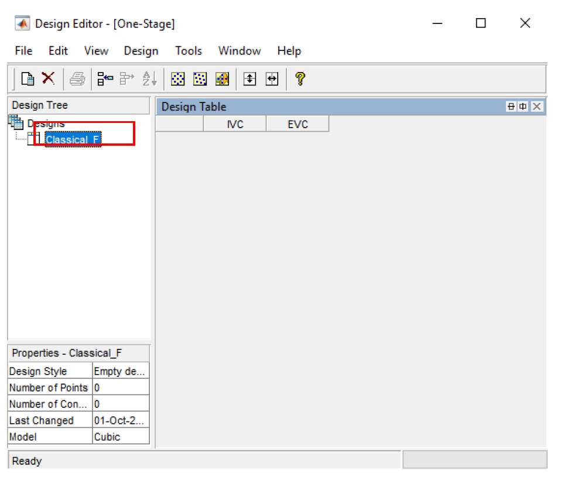
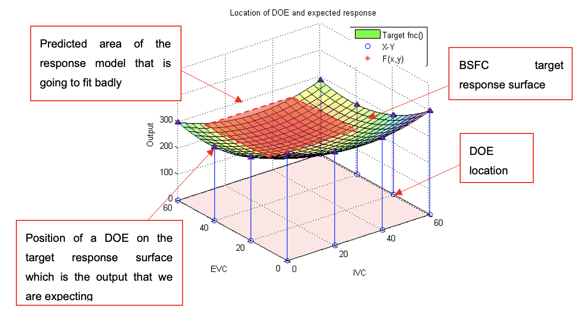
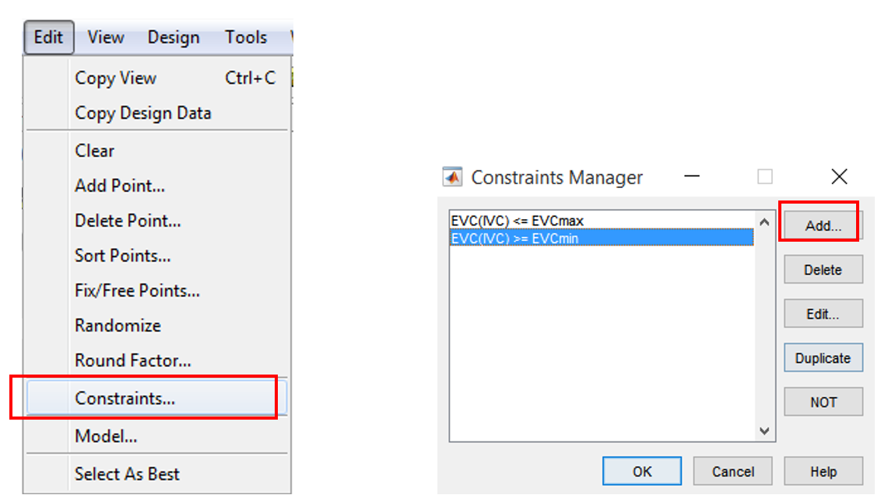
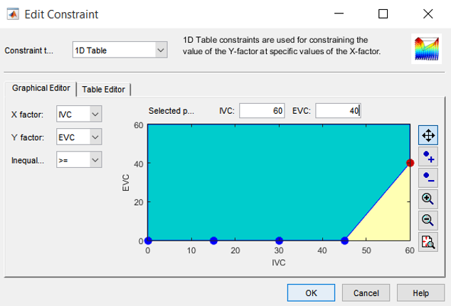
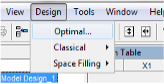
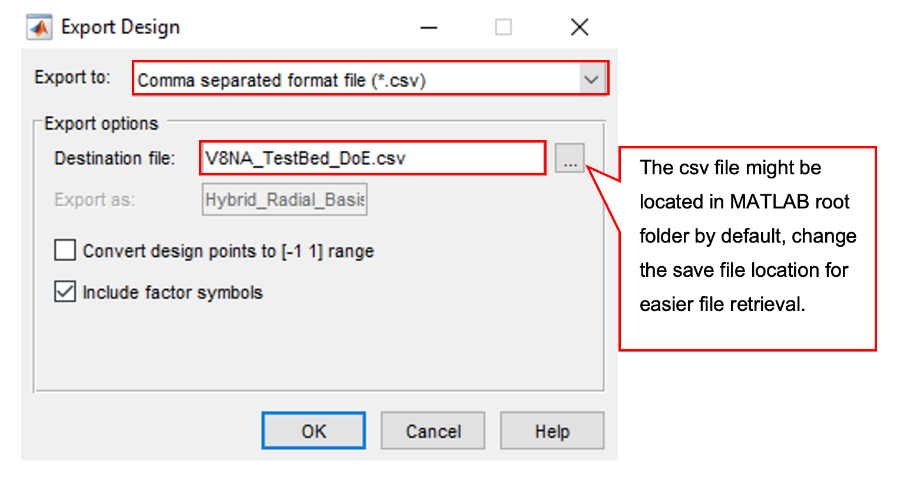

# Lab 2: Design of Experiments
{: .no_toc }

<details close markdown="block">
  <summary>
    Table of contents
  </summary>
  {: .text-delta }
1. TOC
{:toc}
</details>

## Topics
{: .no_toc }

- Aims and Objectives
- Background Information
- Exercise 2-1: Cam Timing Design (Two Inputs)
- Exercise 2-2: JLR Example (Eight Inputs)

## Learning Outcomes
{: .no_toc }

By the end of this lesson, you will be able to:

- Generate Full Factorial, Space Filling and V-Optimal experimental designs
- Test design proposals and augment them for application
- Analyse the effects of design variations on model predictions

## Aims and Objectives

The aim of this exercise is to learn how to design an experiment for a calibration task, and will include the creation of several Design of Experiment (DoE) proposals. Introductions will be given to constraints and evaluating model fits for particular designs.

## Overview of Exercise

The calibration task focuses on mapping the engine fuel consumption across a range of intake and exhaust cam settings ($$y_{IVC},x_{EVC}$$).The relationship between Brake Specific Fuel Consumption and Intake/Exhaust Cam Timing for a particular engine can be expressed as:

$$
\begin{equation}
f_{bsfc}(x_{EVC}, y_{IVC}) = \left(\frac{x_{EVC}-32}{4}\right)^2 + \left(\frac{y_{IVC}-58}{3.8}\right)^2+2y_{IVC}+112
\label{eq:target_function}
\end{equation}
$$

In order to calibrate effectively, an experimental design that minimises the amount of testing whilst covering as much of the operating space as possible is required. One possible approach before physical testing is to determine the DOE using a "target function". We will generate several DOE proposals for this case study using the above BSFC equation as the target function.

We will limit the input variables as below:

$$0<=x_{EVC}<=60\notag$$

$$0<=y_{IVC}<=60\notag$$

## Background Information

The following provides a very brief introduction to the topic of experimental design, for a more comprehensive overview please refer to the lecture slides and prestudy material

### Introduction to DOE

The MBC toolbox design browser can be used to design experiments (DOE) for collecting data (i.e engine performance responses like emission, torque output and fuel consumption). The design browser is a powerful tool which can be used to create complex experimental designs. Experimental design is important because it creates test sequences comprising input variable values in the most efficient manner.

The flow chart for designing an experiment and testing is shown in the figure below. Three different designs will be used for comparison purposes. The designs will be compared by testing each one in a “DOE testing kit” script. The outcome can be observed and changes/observations recorded.


### Introduction to Cam Timing Design Exercise

An engine is fitted with Variable Cam Timing (VCT) for both exhaust and intake cams. For a particular engine speed and load the changes of cam timing will affect the engine fuel consumption. The figure below shows a valve lift diagram for intake and exhaust. Advancing or retarding a cam will affect intake, scavenging or exhaust backpressure. These changes are influenced by the amount of overlap and intake/exhaust valve opening/closing which in turn affects the fuel consumption and other factors.


Recall that the calibration task is to map the engine fuel consumption across a range of intake and exhaust cam settings. An experimental design is required to do this in the most efficient manner by running the fewest experiments and obtaining the most information to accurately map the fuel consumption. We will generate several DOE designs for this case study.

The relationship between fuel consumption and intake/exhaust cam timing for a particular engine can be expressed using the target function, Equation \ref{eq:target_function}. To determine how well the DOE able to give best response surface predictions, we will compare it against the same target function but mapped at high resolution.


---

### Exercise 2-1: Cam Timing Design

Before you begin download the files required for this exercise from LEARN or [here](https://lunet-my.sharepoint.com/:u:/g/personal/ttbm2_lunet_lboro_ac_uk/EdY_zo2jZgZFnWikxFrXx9wBpgXgi9jIybiiGc8buIoOdw?e=UjmUY9)

There are four distinct tasks in this exercise, which are listed below:

- Generate several DoE proposals
- DoE Testing and Evaluation
- Constrained Designs
- Optional Exercise
  
---

#### Task 2-1.1: Generate several DoE proposals

In this task you will be creating several experimental plans for comparison classical, space filling and v-optimal.

- Start MBC Toolbox Interface

Double-click the MATLAB&copy; icon to start MATLAB&copy;. Once initialisation is complete enter ``<mbcmodel>`` at the command prompt to start MBC Toolbox. The Model Browser window appears.

Choose [File >> New Test Plan] in the menu. A test plan frame appears. Select [One-Stage Model]. Click [OK].

- Specify the input factor names and ranges

Double-click the Local Model Inputs block in the diagram. Increase the number of factors to two. Change the symbols of the two input factors to IVC and EVC and enter the input factors range as shown in the figure below.


- Creating classical design (full factorial option)

Right-click the local model in the diagram and choose set up model. Ensure the model class is set to linear model and then click [OK] (the type of model doesn’t matter at this stage). Next, right-click the local model in the diagram and choose [Design Experiment].


Choose [File >> New Design] or click the [New Design] button in the toolbar. A new node called Linear Model Design appears. Click the new node, a 2D projection appears on the right. Rename the new node Linear Model Design to Classical_F by clicking the name and press F2 or the right mouse button then select [Rename Design] from the menu.



Choose a classical design by clicking the [Classical Design] button in the toolbar or choose [Design >> Classical >> Design Browser] then select [Full Factorial] from the [Design type] drop-down menu.


Increase the number of levels for each factor from 2 to 6, keep the number of center points as 0. The total size of design is 36, you may view your design in different projections using the tabs (1-D, 2-D) under the display.

1-D: you may select a different factor to view each level of this factor. The frequency indicates the number of each level that appears among all design test points (36). From the view of this design we see a full factorial design the test points are evenly distributed among the factor space.


Click [OK] to close the Classical Design Browser and return to the Design Editor window. The Design Editor will show the Design Table which includes all the factor inputs combination as result of the design.


You may copy the data to other programs such as Excel by selecting [Edit >> Copy Design Data] from the menu or right click the mouse on any part of the Design Table and select [Copy]. For the case study, we need to export the design into a *.csv file. Save the design as “Classical_F.csv”.


- Creating Space Filling Design (Latin Hypercube option)

Create another design called Spacefilling_LH by clicking [File >> New design]. Select this design node then open the Space Filling Design Browser by clicking [Design >> Space Filling >> Design Browser] from the menu or click the [Space Filling Design] button in the toolbar.

A dialog box asking about DOE points modification may appear, select [Replace the current points with new design].


In the Space Filling Design Browser window, select [Latin Hypercube Sampling] design type and try different selection criteria to see its effect on the design points from the projection view. Set the number of points to 36. Click [OK] when done.


Now export the design to a *.csv file. Save the design as “Spacefilling_LH.csv”.


- Creating Optimal Design

Create another new design called Optim_V. Select this new child node then open the Optimal Design Browser by choosing [Design >> Optimal] from the menu or click the [Optimal Design] button in the toolbar.


In the Optimal Design setting window, set the optimal design parameters to the ones shown in the figures below. All are kept at default values except the Optimality criteria “V-Optimal” and total number of points “36”. Click the [OK] button to start optimising the design. The optimisation process stops when the number of iterations without improvement reaches the pre-set value (36) or number of iterations performed reach the pre-set value in Algorithm tab.


When the optimisation process ends you may see the design table and projection view in the Design Editor window.


Now export the design into a *.csv file. Save the design as “Optim_V.csv”.

---

#### Task 2-1.2: DOE Testing and Evaluation

- Load DOE test kit

Change the MATLAB&copy; working directory to the current folder. In that folder run the DOE_testkit_V11_R7.p in MATLAB&copy;, Right click and run the script.


It is easier to run the script with the command window undocked.


- DOE testing kit overview

This testing kit helps to visualize the effects of a 2D DOE design to a response model. The model estimation capabilities depend partially on the quality of the DOE. Fewer test points are going to cause the model to miss some important characteristics of the system.

The testing kit can accept any type of DOE and equation as target functions. It can create a custom DOE within the program itself as well as add or remove existing DOE design loaded from a csv file. Finally, the user will be able to save the design together with the predicted output. The figure below shows the interface of the testing kit.


- Load DOE

Select [Option 2] and press enter to load the DOE. Select “DOE_poor_design.csv” which is located in the current folder and press [Enter]. The program status will indicate a DOE has loaded. A figure will appear which contains the subplot for the DOE test point distribution along with its histogram.


- Define target system response

Select [Option 5] to enter the BSFC response function from the problem statement. Enter the following function:

```matlab
(((x-32)/4)^2+((y-58)/3.8)^2)+2*y+112
```

The function will be plotted on the DOE design.  The stem plot of subplot 2 shows the position of the DOE on the target surface response. Observe the position of the DOE points, the DOE only covers the outer part of the target response. It misses the center region of the response which may lead to poor modeling results. The key to designing a good experiment is the distribution of points at critical locations. Since we already the surface characteristics we predict that the center region of the surface is going to under fit. Normally, for unknown systems, randomly positioned DOE points are important to ensure sufficient coverage of the operating space.



- Test the DOE points using the BSFC function

Select [Option 9] to test the DOE design. The DOE design sequences are used as input variables to the target function. The input variable are IVC and EVC.

It is expected that the model is going to fit poorly in the center region. Observe the boundary of the DOE design the model manages to predict fairly well. The plots shown below are the overlay of the expected response and response fit using the DOE design. The plot on the right is the contour plot of the differences between both surfaces. The differences are calculated by meshing both surface in high resolution and calculate the target BSFC output. The RMSE of both surfaces are relatively high indicating high modeling error.


- Improving the modelling results
  
The error can be reduced by introducing more DOE points across the operating space. This extra points provide extra information about the curvature of the response model. By adding support points in the middle of the current DOE design the model prediction will be improved.


To add new DOE points go to [Option 7] and enter the X and Y coordinates of the new points. Enter the following coordinates, the model will be automatically updated as new points are entered. Once done, type “exit” to go back to the main menu.


Now, the model has improved with lower modelling error. Take note of the center region of the response surface. The response model built using the DOE with support points has improved with very low RMSE.


- Save the design and results

The current DOE design along with the results and screenshot of the figure can be saved by entering [Option 10]. The files will be saved in the current MATLAB&copy; folder.

- Repeat the step 3 to 7 for the other saved DOE designs

Repeat step 3 to 7 as above for each of the saved DOE designs listed below (generated earlier using MBC model browser in Task 1). For each of the designs, try removing some DOE points and observe the changes to the histogram. Then, observe the effect of removing the DOE points to the response surface and RMSE.

---

#### Task 2-1.3: Constrained Designs

The previous design characterises bsfc well, but exceeds some important engine performance limits, and may cause damage to the hardware.   Apply constraints for the following DOE designs:

- Full factorial design (6 levels for each variables)
- Space filling design (Latin Hypercube Sampling)
- V-optimal design
  
Follow the steps shown below on how to constrain a design. You will need to recreate a new tree in addition to the DOE design, because a constraint can only be applied to the most recent design. Create  a new design tree for each design. For this task, regenerate all designs, starting with optimal design.


Designs can have any number of geometric constraints placed upon them. Each constraint can be one of four types: an ellipsoid, a hyper-plane (or linear), a 1-D lookup table, or a 2-D lookup table. Click [File >> New Design]. Rename the new node Optim_V_C. Choose [Edit >> Constraints] from the Design Editor menus. The Constraints Manager dialog appears. Click [Add].



The Constraint Editor dialog with available constraints appears. The default 1D Table is selected in the Constraint Type drop-down menu. Select X factor IVC and Y factor EVC. Move the large dots (click and drag them) to define a boundary. The boundaries are as showed below.




Click [OK]. Your new constraint appears in the Constraint Manager list box.

- Generate optimal design within constraint boundary

Select this new child node, then open the Optimal Design Browser by choosing [Design >> Optimal] from the menu or click the [Optimal Design] button in the toolbar.


In the Optimal Design setting window, set the optimal design parameters as before. All are kept default except the Optimality criteria “V-Optimal” and total number of points “36”. Click the [OK] button to start optimizing the design. The optimizing process would stop when the number of iterations without improvement reaches the pre-set value (here its 36) or the number of iterations performed reaches the pre-set value in Algorithm tab.


When finished save this design in the MATLAB&copy; current folder.

- Generate constrained designs for all other DOE types.
  
Repeat creating constraints for the other DOE designs. The constrained DOE designs should look like figures shown below:


- Analyse all constrained DOE designs using DOE testing kit

Load and retest each DOE designs in the script. Save the results after fitting the model.


---

#### Task 2-1.4: Optional

- Try generating your own DOE design using option “3” in the DOE testing script.
- Also try:

  - Space filling design (Stratified Latin Hypercube Sampling)

    

  - Space filling design (SOBOL Sequence)
    - Try generating 10 DOE points and keep generating in sets of 10. Observe how the points are distributed.
    - SOBOL sequence is a quasi-random design which is capable of supporting progressive augmentation of experimental design. How does this help in reducing modeling time?

### Exercise 2-2: Cam Timing Design

The aim of this exercise is to continue the DoE learning process using a real-world example. This forms part of the second part of the DoE exercise.

This part of the exercise consists of an experiment design followed by virtual engine testing that forms the first part of modelling a V8 spark ignition engine. You will use a single stage model and create a space filling design. You will then use the Design of Experiments (DOE) points generated and test it using a virtual engine Simulink&copy; model. The Simulink&copy; model will provide you with the experimental test results (datasets) which will be used for creating V8 engine model during the calibration-optimisation lab. The results generated from this lab task will be used for the modelling lab. Please save the generated result in the active folder (or your current MATLAB&copy; folder).

The following figure shows the flowchart for this second task in the Design of Experiments Workshop


---

#### Task 2-2.1

- Start the model browser by typing ``<mbcmodel>`` in command window. Create  a one stage test plan by right clicking on the [Untitled] project node and click [New Test Plan]. Select [One stage plan]. Click [OK] to make the selection.


- Double click the “Input” diagram, set “Number of factors” to 8 and enter the following data as shown below for the  “min”, “max” and “signal” columns in the setup window.


---

#### Task 2-2.2

- Right click on the model icon in “Test Plan” pane, and select “Design Experiment”. The “Design Editor” window will appear. This where the DoE points can be created and constraints can be applied for known systems.


- Create a new test design by clicking on the toolbar [File >> New Design]. An empty design will be created in the “Design Tree” pane. The design table will list down all the created test points. If the 3D projection doesn’t appear, click on the toolbar, [View >> Split View >> 3D Design Projection]. The 3D design projection view will be shown.


- Now create a Sobol design by clicking [Design >> Space Filling >> Sobol Sequence]



- Set the number of design sequences to 350 and click [OK] to start generating Sobol sequences.


- Once the DoE points have been generated, the “Design Editor” will load the DoE points in the “Design Table” and “3D Design projection”. If the 3D projection doesn’t appear, click on the toolbar, [View >> Split View >> 3D Design Projection]. The 3D design projection will show the points that have been created. Now, export the design, so that it can be used for engine testing at the test bench. To export the design, click the toolbar [File >> Export Design]. Save as *.CSV format and name it to “V8NA_TestBed_DoE.csv”. The csv file might be located in Matlab root folder by default, change the save file location for easier file retrieval. Now, close the design editor.
  




For this exercise, the DoE test points were designed for an unknown system (No knowledge of the engine limits). For that reason, no constraints will be used for this exercise, and a space-filling DOE style is used. By applying practical knowledge, constraints may come from engine modelling or early tests of an engine prototype.

---

#### Task 2-2.3

- Make sure you have downloaded the “TAS 2015” folder from learn. The files in “TAS 2015>>2. DOE lab ” folder are required to run the virtual engine test. The files required are shown in figure below. Set the Matlab directory path to the “TAS 2015” folder or whichever folder you have saved the contents of TAS 2015 folder. Copy the “V8NA_TestBed_DoE.csv” into the current MATLAB folder so that the script will be able to find the design file.


- The virtual engine test requires initialisation. The initialisation will automatically load the saved DOE points (“V8NA_TestBed_DoE.csv”) into the workspace and apply a time stamp to the design for it to be used in the virtual engine test &copy; block. Open  V8NA_TestBedData_400_Mdl_init.m” within the MATLAB&copy; environment and execute the script. Once the execution has completed, a new variable is loaded into the MATLAB&copy; workspace.

- The DOE points are automatically loaded into the MATLAB&copy; workspace, it is important to check if the DOE points are in the correct form. Open the “V8NA_TestBed_DoE” variable in the workspace by double clicking on it and check the values in the “Variable Editor”. Take note that the 1st column is the time stamp which will be used when running the Simulink&copy; block.


- Open “V8NA_TestBed_400.slx” in Simulink&copy;. Run the simulation by pressing [Start Simulation] button. The simulation time is set at 350 seconds. After the simulation has completed, the test results (“V8NA_TestBed_Data”) will be saved in the MATLAB&copy; workspace.


- Use the “Save_Test_Result.m” script to convert the test result matrix into a csv format. The test will be saved as “V8NA_TestBed_Data.csv”. We will use the test result obtained for the modelling exercise during the modelling lab.


- Now, close the Simulink&copy; model. Save the workspace items as “V8NA_testplan.mat” by clicking [File >> Save Project As]. The saved test plan will be used for the following lab classes.


---
