# Lab 4: Modelling a V8 Engine

{: .no_toc }

  

    Table of contents
  

  {: .text-delta }
1. TOC
{:toc}

## Topics

{: .no_toc }

- Aims and Objectives
- Overview of Exercise
- Background Information
- Exercise 4: Engine Modelling V8 Engine Example

## Learning Outcomes

{: .no_toc }

By the end of this lesson, you will be able to:

- Demonstrate modelling methods on real world engine data
- Fit and evaluate a number of model types
- Investigate model selection techniques

## Aims and Objectives

The aim of this exercise is to demonstrate methods that may be applied to modelling of engine data generated during tests on a JLR V8 (NA) engine.  The exercise includes the fitting and evaluation of a number of model types as well as an investigation into the techniques required for selecting the best model from a set of candidate models. Following this, the quality of RBF and polynomial models will be compared.

## Overview of Exercise

Once data has been acquired during an engine test, the first step in handling the data will be the creation of a model.  The reason for developing a model is to allow ready access to the data since it is now represented in a functional form, and to allow interpolation because the tests are conducted at discrete points, and for the calibration process, data must be available at all possible values of the controlled parameters of the engine. However there are choices to be made in the modelling process – and in particular the type of model and its particular form.

In part two of the exercise, you will fit and use an RBF model in place of a polynomial model, prior to using the model to support the generation of an engine calibration using the CAGE tool.  You will be looking for any differences in the accuracy of the model and its ability to support the optimisation process.

### Background Information

A polynomial model is simply made up of terms that are themselves functions of the independent or control variables.  The ideal model is simple in form so that it can be interpolated quickly, accurately models the data and is capable of being generalised.

For some engine phenomena a polynomial model meets these sometimes conflicting goals. However for other engine functions a polynomial is simply unable to represent the behaviour of the data and a different technique is needed.  Very often a radial basis function (RBF) is deployed.

 RBF techniques have been developed for other applications, and notably computer graphics, where the model if the behaviour of an image needs to be processed quickly.  The RBF can be used to represent the sometimes complex relationships in a way that is quickly computed.

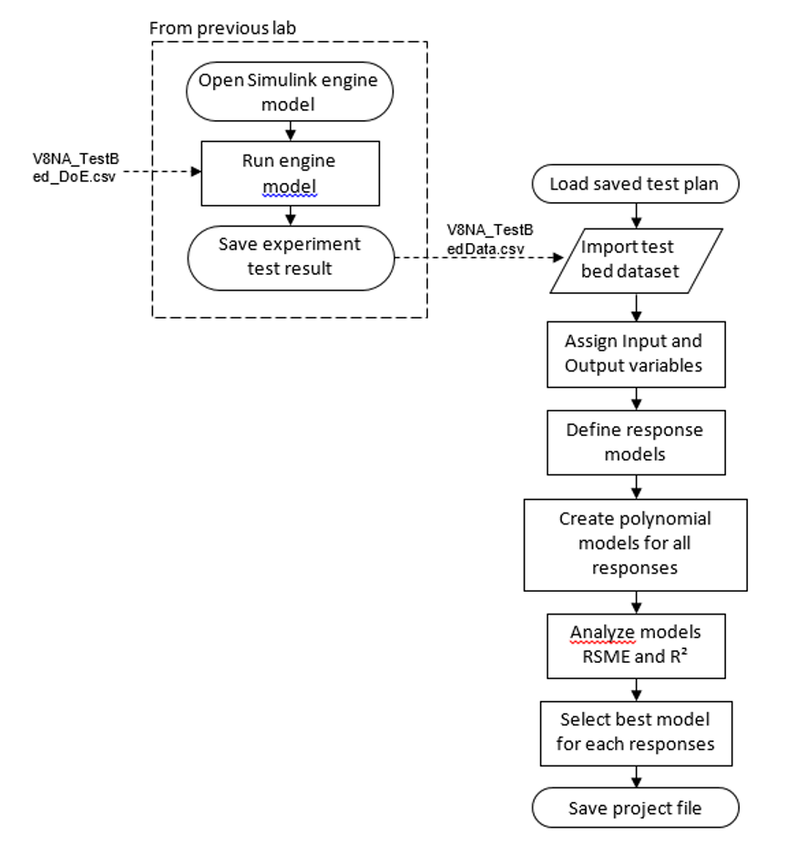

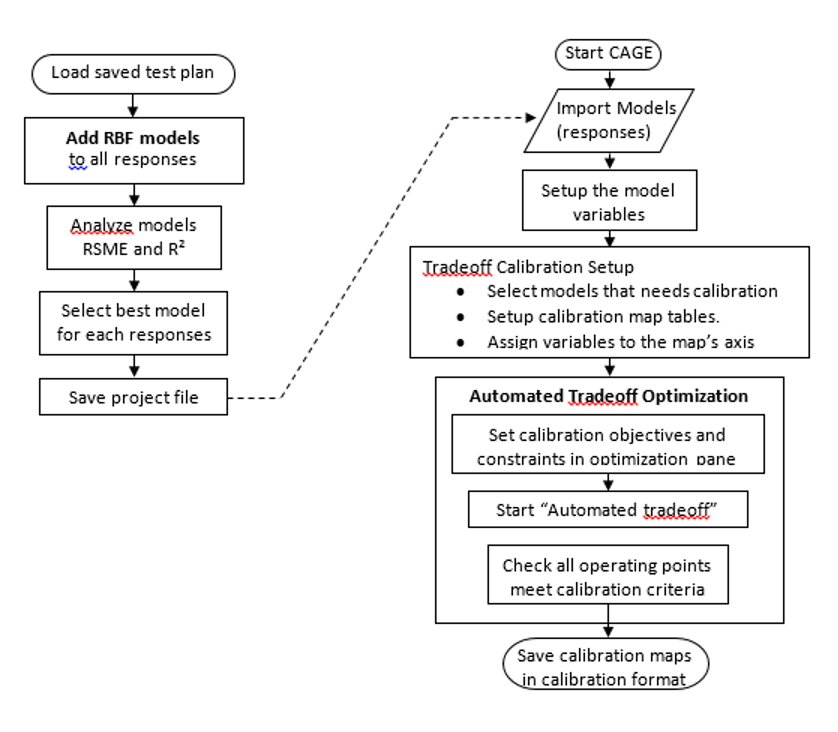

---

### Exercise 4: Engine Modelling – V8 Engine Example

- Task 4-1: Loading JLR data
- Task 4-2: Analyse model RMSE
- Task 4-3: Building Models for a V8 Engine using Radial Basis Functions

---

#### Task 4-1: Loading JLR Data

Previously, the created DoE test points were used as engine test points on the test bench. Once the engine test has finished, the test technician will send the engine test results. This stage of MBC will use the test result to create an engine model.

- Start MBC Toolbox using the command ``<mbcmodel>``. Use the previous design browser setup by loading the saved test plan from previous lab “V8NA_testplan.mat”. Click [Select Data] icon to open the “Data Selection Wizard”.
- Click the file open icon to start the “Fit Models Wizard”.

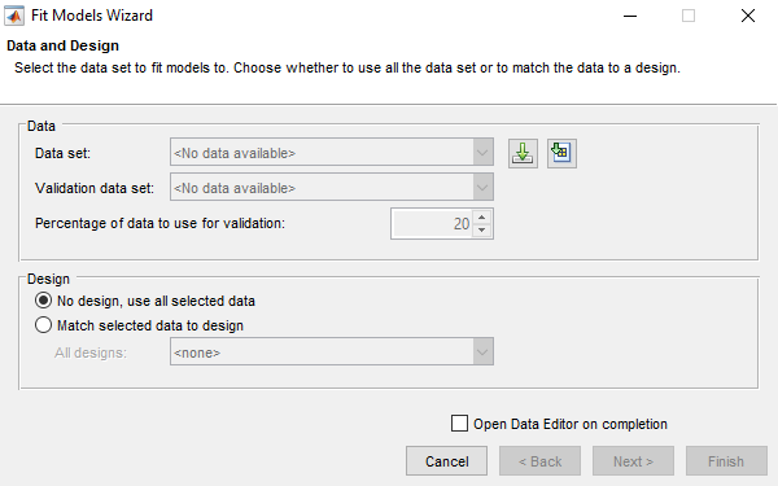

- Load the “V8NA_TestBed_Data.csv” file which is the result from Part 2 of the DOE lab. When prompted to confirm Delimited Text File format, press [OK]. Then, click [Next] in “Fits Models Wizard” window.
  
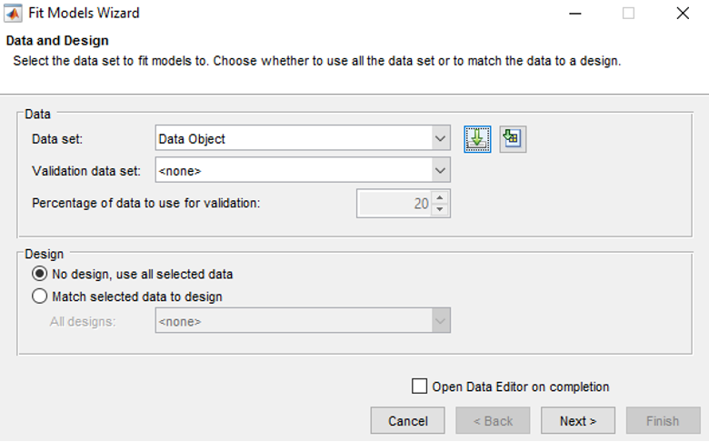

- This step is to assign the input names according to the data signals. The program will automatically assign the names; since the test bed data names are the same as the input names. Click on each of the names in the “Model input factors” and compare with the ones in the “All data signals”. Click [Next] when all the variables are correctly assigned.

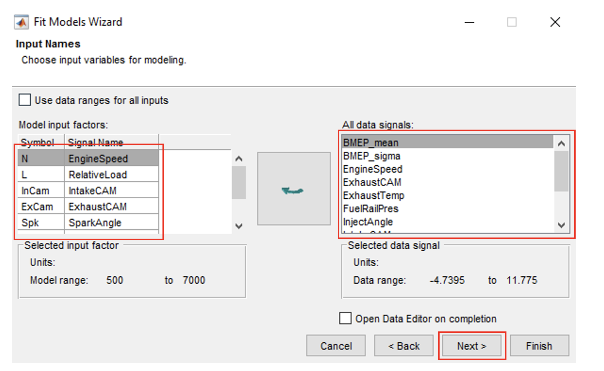

- This is the process for defining the output variables. Select a signal and click [Add] to make selection. Add the following variables; “BMEP_mean”, “BMEP_sigma”, “IntakeFuelMass” and “ExhaustTemp”. Click [Finish]” when done.

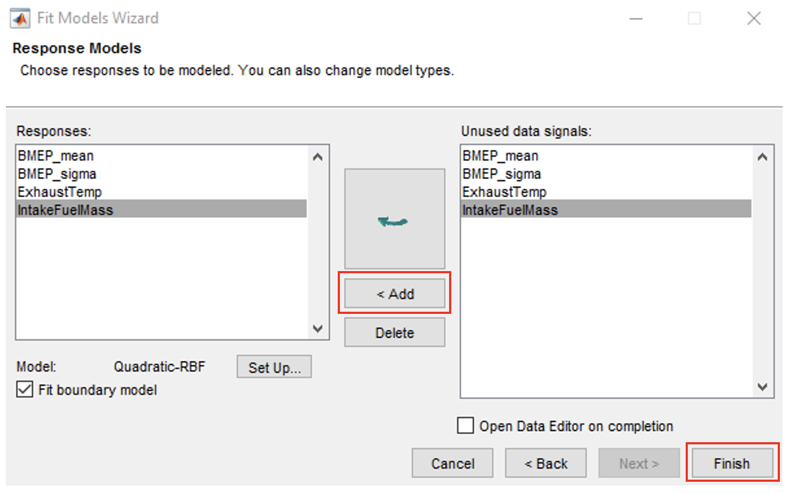

- Once the data has been loaded, the four response models are created as the default model selection. The next steps will show how to make different models and compare which have the best RMSE (Root Mean Squared Error).

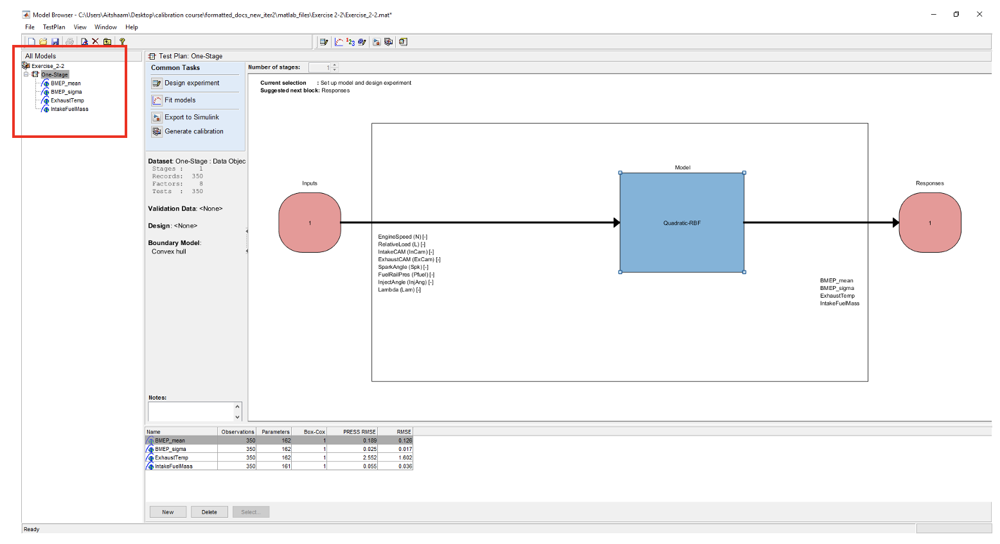

- Now create a polynomial model by right clicking on [BMEP_mean] and click [New model]. Change the model class to Linear models, define all polynomial order to 1 and interaction order to 1. Change stepwise from “None” to “Minimize PRESS”. Predicted sum of squares error (PRESS) is a measure of the predictive quality of a model. Minimize PRESS removes terms in the model to improve its predictive ability, removing those terms that reduce the PRESS of the model.
- Click [OK] to close the setup. To create multiple models more quickly, use the build tool.  For polynomial models, the build tool will automatically include necessary interaction terms.

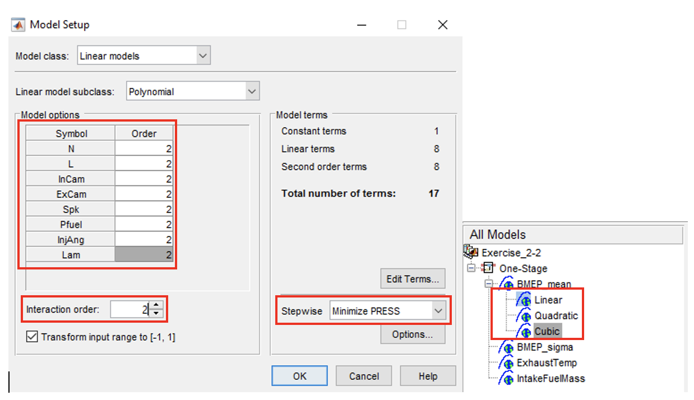

- Repeat the same process and create the following models (Leave “Model class” & “Linear model subclass” as it is):
  - Quadratic model (order: 2 Interaction order: 2)
  - Cubic model (order: 3 Interaction order: 3)
- Repeat these processes (polynomial models of orders 1, 2 and 3) for the other 3 response models (BMEP_sigma, IntakeFuelMass and ExhaustTemp).

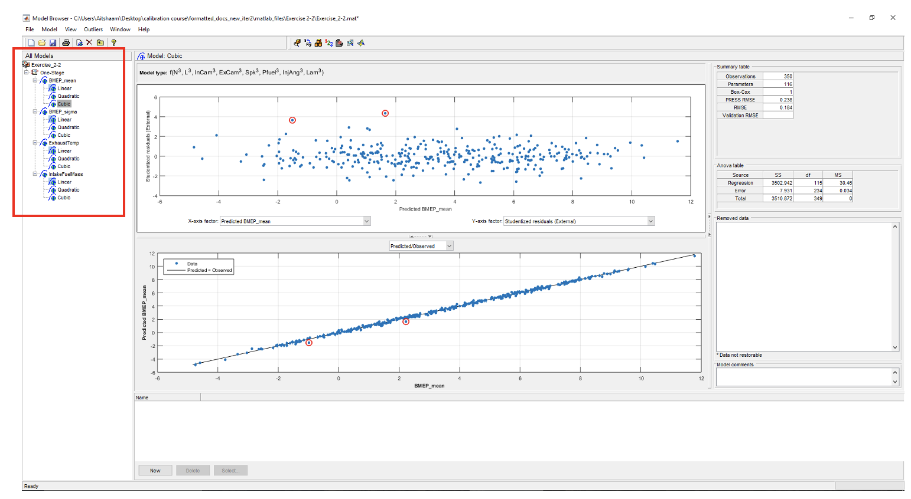

---

#### Task 4-2: Analyse Model RMSE

- Click on the [BMEP_mean] response model. In the analysis pane, the RMSE of each model is calculated. To enable $$R^2$$ calculation, click on [BMEP_mean] response model and go to [Model >> Summary Statistics]. Check the PRESS $$R^2$$ and $$R^2$$ options. **Do this for all response models**.

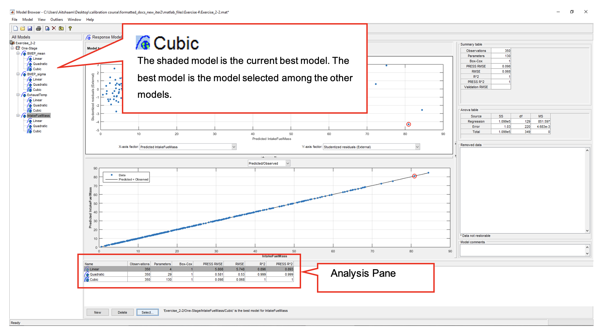

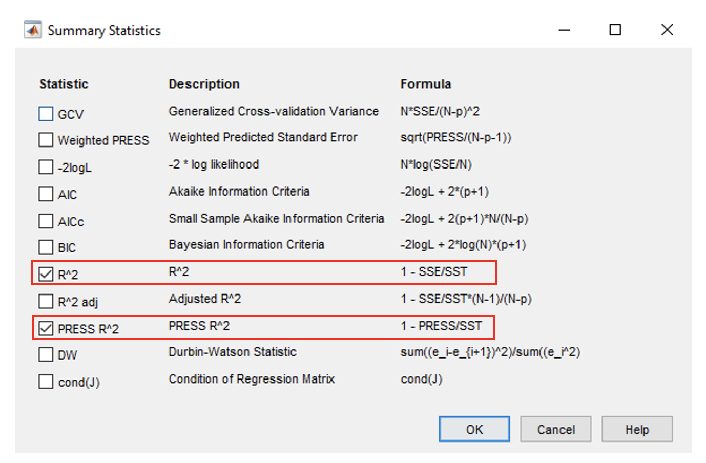

- Starting with “BMEP_mean” response model, click [Select] in the model browser. The “Model Selection” window will appear.
- Based on the RMSE, the “Cubic” offers lower RMSE, but is a much more complicated model.  Try to answer the question as to which is the best model.  (As a starting thought, consider the trade-off between accuracy and the use of a much large number of parameters).
- Choose what you consider to be the best model for the “BMEP_mean” response model. Select the model and click [Assign Best]. Now, close the selection window and click [Yes] to confirm.

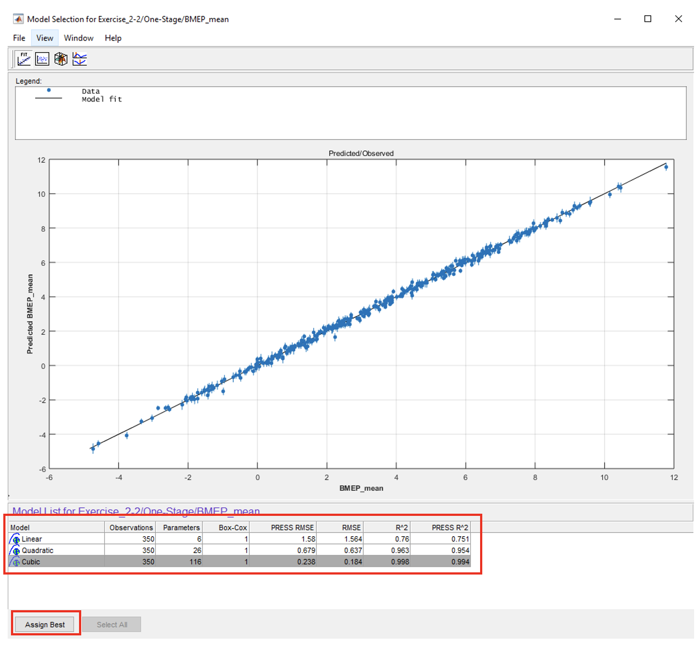

- Now, for the other 3 response models (BMEP_sigma, IntakeFuelMass and ExhaustTemp), assign their best model by repeating processes 1 and 2 shown above.

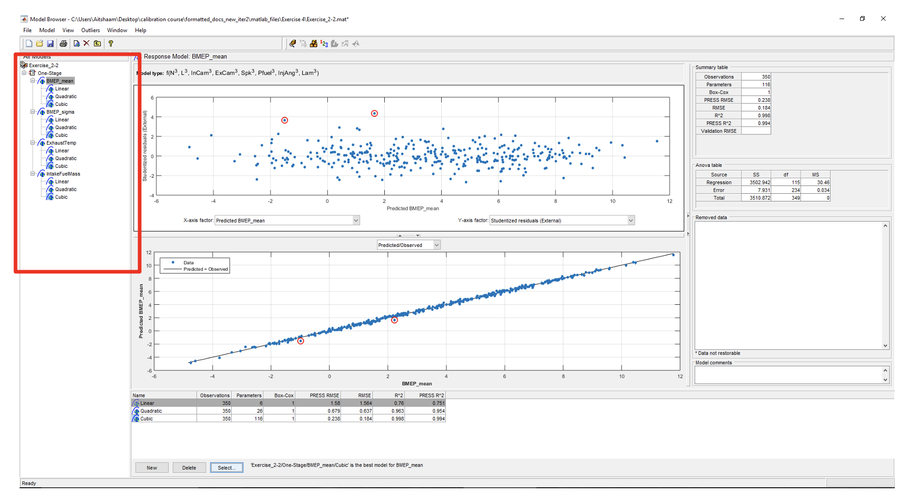

- Now, observe the residual plot of each responses best model. The red highlighted circles are the residuals. Residuals need to be removed because they are outside of the normal distribution of the data. Click on the best model in BMEP_mean. The outliers selection criteria can be found in [Outliers >> Selection Criteria].
  
The default residual selection remove data points outside 3. Studentized residuals are normalized residuals which sometimes are referred to as z-score. Literature suggests the use of z-scores between 3-3.5. As of now, we use the default residual settings.

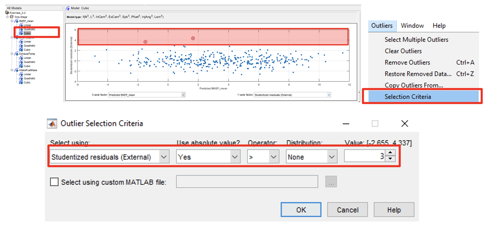

- To remove outliers, click [Outliers >> Remove Outliers]. The outliers will be removed. Remove until all outliers have disappeared. Do this for all best models. You may remove outliers for all other polynomials. But most probably cubic design will be selected, because of its low RMSE error compared to other model types.

Take extra precaution when removing outliers, always observe the PRESS RMSE while doing so. The model might become "over-fit" if too many data points are removed. This means that the model is too closely fit to a small number of points, and doesnt "generalise" well to data that is not included.

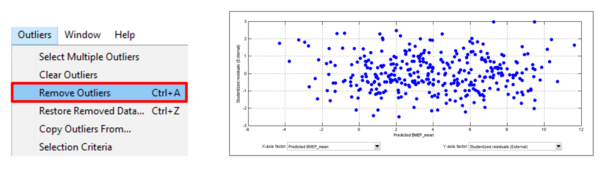

- After removing outliers, the best model selection will be removed. So, reassign best model again by repeating Step 2: no 2.
- Click [Select] in the model browser. [Model Selection] window will appear. Select the best model and click [Assign Best]. Now, close the selection window and click [Yes] to confirm.

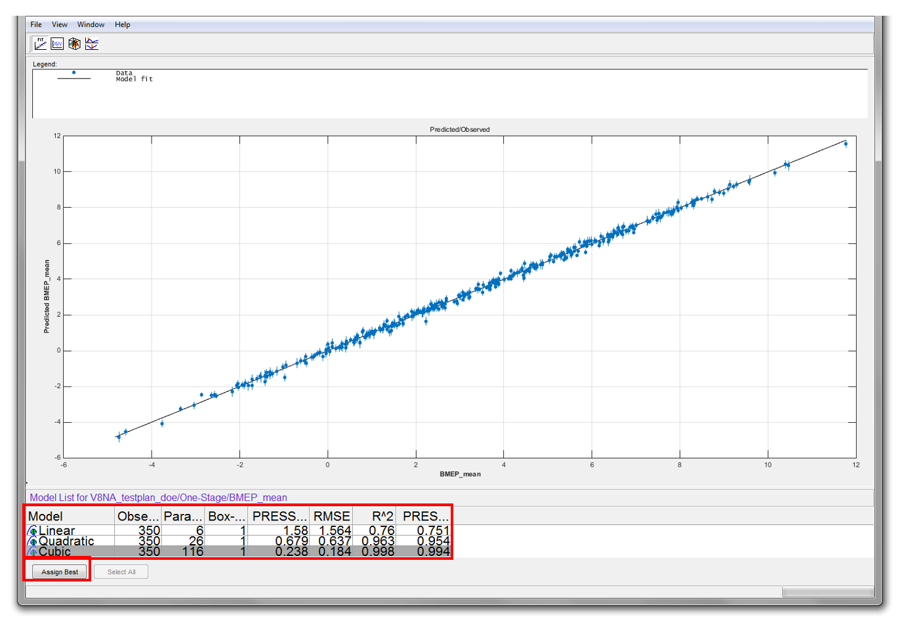

- Repeat step 4 to 6 for the other three models. Remember to reselect best model (step 6) after removing outliers.

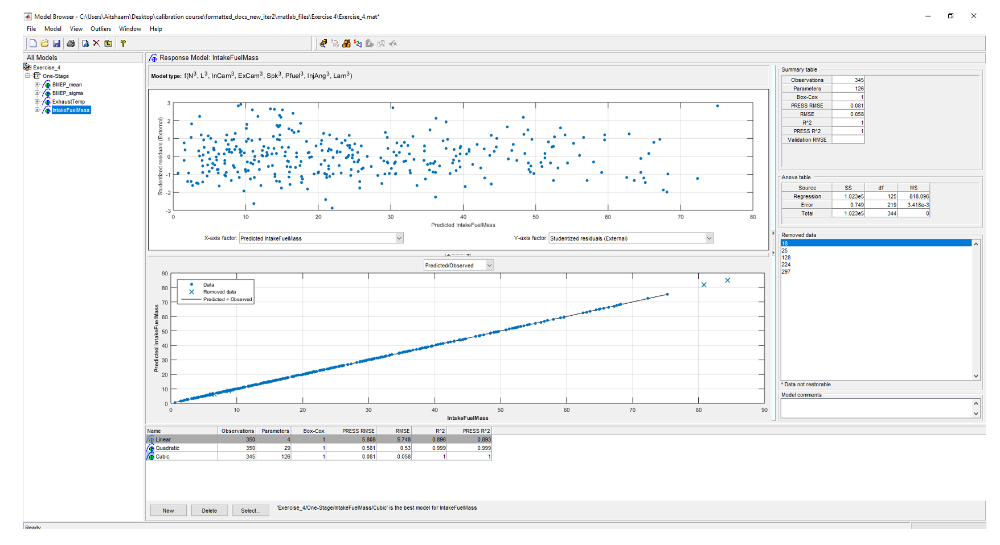

---

#### Task 4-3: Feature Calibration for a V8 Engine using Radial Basis Functions

- Use “Build models” tool to add RBF models to your current response model. Generate RBF models with centres ranging from 30 to 350 with 10 models linearly spaced (as in figure below). Use ``<linspace>`` function when defining the centres of the RBF model.
- Repeat the procedure above for all response models. Select the best model for your responses.

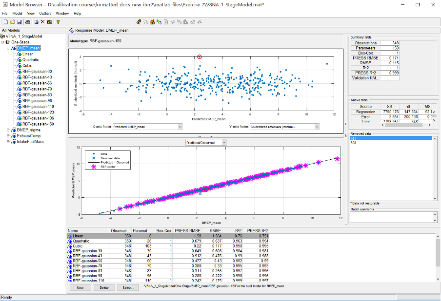

Save the project when finished.
