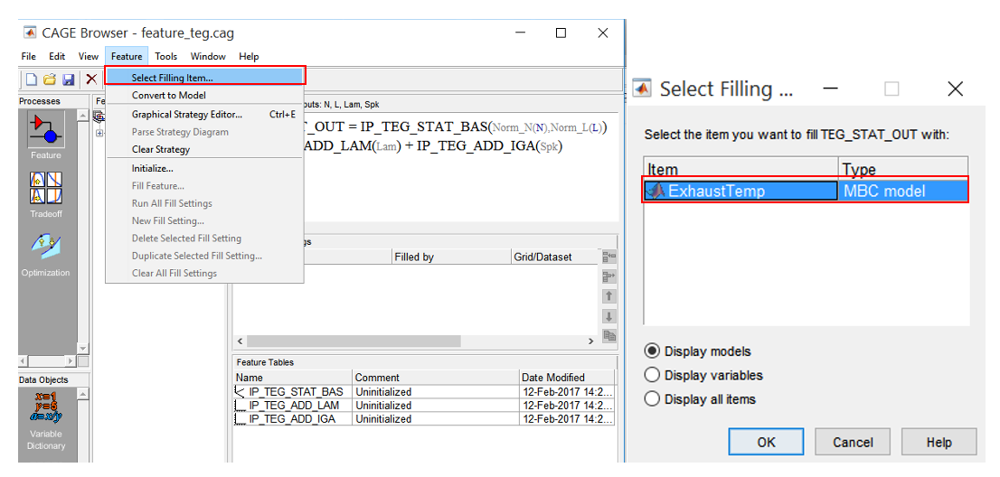
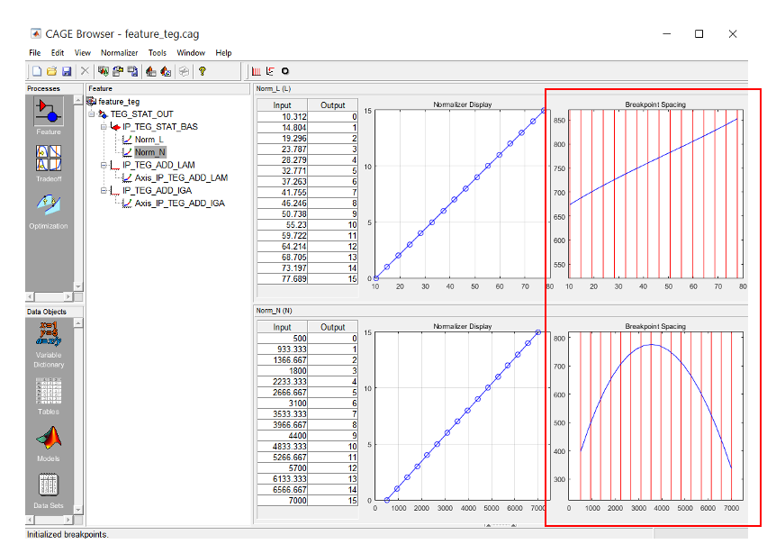

# Lab 5: Feature Calibration V8 Engine Example
{: .no_toc }

  

    Table of contents
  

  {: .text-delta }
1. TOC
{:toc}

## Topics
{: .no_toc }

- Aims and Objectives
- Overview of Exercise
- Background Information
- Exercise 5: Feature Calibration for a V8 Engine

## Learning Outcomes
{: .no_toc }

By the end of this lesson, you will be able to:

- Set up models, features and ECU strategy
- Use this information to set up calibration tables
- Perform feature calibration

## Aims and Objectives

The aim of this exercise is to fill in the tables in the ECU strategy using the exhaust temperature response model from V8NA_1_StageModel.mat, which was generated from the modelling workshop.

## Overview of Exercise

The ECU strategy to be calibrated is the ECU exhaust temperature model. This model is used to  predict of the exhaust temperature. The engine has an exhaust temperature limit of ~800-900degC; when the predicted value reaches this threshold, fuel injection quantity is in turn controlled to avoid exceeding it. A simplified ECU exhaust temperature model strategy is shown below:

This strategy calculates the static exhaust temperature (TEG_STAT_OUT) based on the base exhaust temperature map (IP_TEG_STAT_BAS) and the correction maps. The correction maps (IP_TEG_ADD_LAM and IP_TEG_ADD_IGA) are exhaust temperature correction with respect to lambda and spark respectively. The ECU strategy is available as one of the files for this module (see the Exercises section later in this document to obtain these).

When the maps are filled with the correct values, the TEG_STAT_OUT should replicate the same output as the exhaust temperature model from the previous V8NA modelling exercise.

The flowchart below describes the feature calibration exercise.

### Background Information

An ECU may contain subsystems or strategies to calculate certain parameters. Some subsystems are modelled to represent a certain behaviour of the engine. These modelled subsystems are designed for specific reasons such as noisy measurement, lack of sensors for measurement, faster system response estimation, etc. Typically, these types of subsystems are modelled using the same model developed during model-based calibration process.

As an example, an exhaust temperature model (TEG) is a representation of the exhaust gas temperature behaviour during static and dynamic engine operation. The system needs to be done this way because it is not economical to install a TEG sensor on every production car. So, a model is utilized to predict the TEG values. The TEG model lies in form of a strategy. A strategy may contain tables, equations, variables or constants. The figure below shows an illustration of how a TEG (static) subsystem is used for exhaust gas temperature control.

The TEG subsystem can’t be calibrated directly using model-based calibration because it is complicated to model using a black-box method (such as the preiously used RBFs). Instead, TEG maps can be estimated using the response model that gives the same output as the subsystem. The figure below shows an illustration on how feature calibration is applied to the engine calibration process.

Feature calibration is an iterative process of filling up the ECU strategy maps. However, the response model from the MBC process cannot upload directly into an ECU. This is because an ECU is not capable of running complex models (due to limited computational power) and usually has a fixed structure which only allows the filling of strategy maps.

Feature calibration converts the response model to a form acceptable for ECU strategy maps. It a process of giving inputs to the empty ECU strategy maps, measuring the output and iteratively filling up the maps with values until the strategy is able to replicate the same responses as the original response model from MBC.

The modelled system (so-called feature) in the ECU is a representation of the MBC response model in a format that is compatible with the ECU. The ECU model doesn’t require any sort of optimization because it is a model conversion from black-box to a set of ECU maps.

Generally feature calibration consists of five different stages:

1. Setup the models
    - In this exercise the variables and models will be loaded from the previous lab exercise
2. Setup a new feature
    - Select a filling model, used to make a comparison between the feature strategy and black-box. For this exercise, the filling item is the exhaust temperature model.
3. Setup the strategy
    - Load the ECU strategy in CAGE
    - Empty maps based on the ECU strategy will be loaded automatically
4. Setup the calibration tables
    - Use calibration manager to assign the breakpoints to the calibration maps
5. Feature calibration
    - Calibrate normalisers. This stage evenly spaces the breakpoints for more efficient profile matching.
    - Calibrate the table. In this exercise, the table is the base exhaust temperature map.
    - Calibrate the feature as a whole. This is the stage where the smaller tables are normalised and calibrated.

---

### Exercise 5: Feature Calibration for a V8 Engine

There are 5 tasks in this lesson:

- Setup/import the response model
- Setup new feature and load strategy
- Setup the tables
- Feature Calibration
- Export Calibration

The files required for this exercise are available [here](({{ site.url }}/ttp451-module/files/Exercise_5.zip))

---

#### Task 5-1: Setup/Import the Response Model

- Start the model browser by entering “mbcmodel” in the MATLAB&copy; command window and load V8NA_1_StageModel.mat test plan (Note: V8NA_1_StageModel.mat is the model generated from previous modelling lab, if it is already open skip this step). Now, leave the model browser open.

- Start CAGE, by entering “cage” in MATLAB&copy; command window. Import exhaust temperature model from, by clicking [File >> Import From Project].

- For this exercise, this feature calibration will fill in a set of maps to predict the exhaust temperature, so the ExhaustTemp model from previous lab exercise should be loaded.
- Click Import Selected Items to load the model. Click [OK] when prompted to import from MBC project. Click [OK] when asked to reconfirm the import. Then, close the CAGE Import Tool. The model will be automatically loaded into CAGE. Use Model in the Data Object pane to observe the model responses. Save the project as “feature_teg.cag”.

The model selected should be the same as the ECU strategy output. Referring to the task of this exercise, the ECU strategy output is static exhaust temperature, so the exhaust temperature model should be imported.

---

#### Task 5-2: Setup new feature and load strategy

- Create a new feature by clicking on [File >> New >> Feature]. Next, load “TEG_STAT_OUT.slx” ecu control strategy. This simple strategy calculates the final exhaust temperature.

- The pane below shows the strategy formula for the exhaust temperature model.

- To view the strategy as a Simulink&copy; model, click [Feature >> Graphical Strategy Editor]. The Graphical Strategy Editor enables us to create or modify the current strategy. It contains a Simulink&copy; block to construct strategies. Once complete, double click on the blue output port to parse the Simulink&copy; block to the CAGE feature.

- Now, fill the TEG_STAT_OUT by clicking on it in the Feature pane and fill the strategy by clicking [Feature >> Select Filling Item…]. This step will use exhaust temperature model to fill in the feature maps.

---

#### Task 5-3: Configure the Tables

- Expand the tables tree to view the normalised breakpoints. Currently the breakpoints are empty because they have not been initialized. Open “Calibration Manager” by clicking [Tools >> Calibration Manager].

- The calibration manager is where the calibration tables are created. The empty tables are created based on the tables defined in the ECU strategy. To do this, click on “IP_TEG_STAT_BAS” and set the number of rows and columns to 16 and set the initial values to 0. Press [Enter] and click [Apply] when done. When prompted “This operation will change the size..”, click [Continue] to proceed with the changes.

- Next, create tables for the other two exhaust temperature correction maps.
- Click on one of the table names in the tree list and set the number of rows to 16.
- Press [enter] and click [apply]. Do this for each correction table. Close the calibration manager when done.

---

#### Task 5-4: Feature Calibration

- Click on one of the normalisers for “IP_TEG_STAT_BAS” to view the breakpoints. First initialize the breakpoints by clicking on [Initialise]. A dialog box appears suggesting the range for each normalisers, click [OK] to accept the default range.

- Now, the initialised “IP_TEG_STAT_BAS” map breakpoints are evenly spaced.

- Evenly spaced breakpoints is not a recommended approach to set up table breakpoints. It may lead to loss of crucial information about the surface curvature. So, the spaces are normalised depending on the critical locations in the curvature. To do this, click [Fill]. A dialog box will appear suggesting the range of variables. Accept the default values by clicking [OK].

- To calibrate the base exhaust temperature map, click on “IP_TEG_STAT_BAS” in the feature tree and click [Fill].

- A dialog box will appear to confirm the selected filling items. Since we have selected the filling item earlier, click [Next] to continue.
- Another dialog box will appear asking to set the input variables of the model. This is where we can set the variables that are not involved in the feature to a preset value. For instance, the exhaust models have intake and exhaust cam input variables.
- However, these variables are not used for the feature strategy, so the cams can be set at the present value. This is because the exhaust temperature only varies with respect to lambda and IGA for this case study. Just click [Next] to continue.

- Next, this is the dialog box to fill in the “IP_TEG_STAT_BAS” table. Check and uncheck the following settings as in figure below. If OK, start to fill in the table by clicking on [Fill Tables]. The Feature calibration will match the model to the tables.
- The errors are iteratively monitored and the training process is stopped when the convergence reach its tolerance value. Once training has finished, click [Finish] to continue.

- The “IP_TEG_STAT_BAS” is now calibrated. The figure shows the data and plot of the base exhaust temperature table.

- The exhaust temperature correction tables require calibration. To do this click on the feature “TEG_STAT_OUT”. Then initialise the correction tables by clicking [Feature >> Initialize].

- Leave everything checked except for breakpoints of “IP_TEG_STAT_BAS” and Values of “IP_TEG_STAT_BAS”. This is because we have initialised and calibrated those maps earlier. Click [OK] to continue.

- Next, fill “IP_TEG_ADD_LAM” with values by clicking [Fill Feature], leave “IP_TEG_ADD_LAM” checked and click [Next].

- Click [Next] on the dialog box. Leave as it is because we have selected the filling item earlier. Again click [Next] when prompted to set the variables values. We leave them as default unless there is a need to park the intake or exhaust cams.

- Next, is to fill in the “IP_TEG_ADD_LAM” table. Check and uncheck the following settings as in the figure below. If OK, start filling in the table by clicking on [Fill Tables]. Once training has finished, click [Finish] to continue.

- Click on “IP_TEG_ADD_LAM” in the Feature pane to view the calibrated table. The table shows the increment and decrement of exhaust temperature with respect of changes of lambda.

- The next step is to calibrate the “IP_TEG_ADD_IGA”. Click on the “IP_TEG_ADD_IGA” in the Feature pane. Then, click [Fill Feature]  to fill in the table. Repeat the same process as above.

- Now, the base exhaust temperature model table “IP_TEG_STAT_BAS” and the correction tables “IP_TEG_ADD_LAM” and “IP_TEG_ADD_IGA” have been calibrated. Click on them to observe the effects of the correction tables to the final exhaust temperature output.

---

#### Exercise 5-5: Export Calibration

- Now, the tables can be exported and the data can be used in an ECU. To export the tables, click on the [TEG_STAT_OUT] in the Feature pane. Then, click [File >> Export >> Calibration >> Selected Items]. Select calibration format and click [OK] when done.

---
