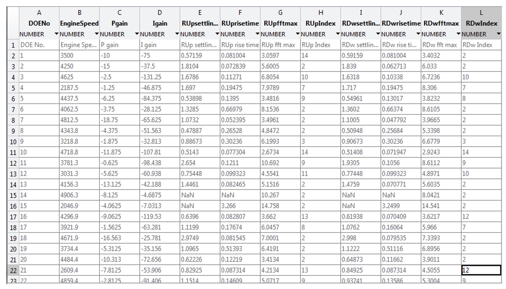
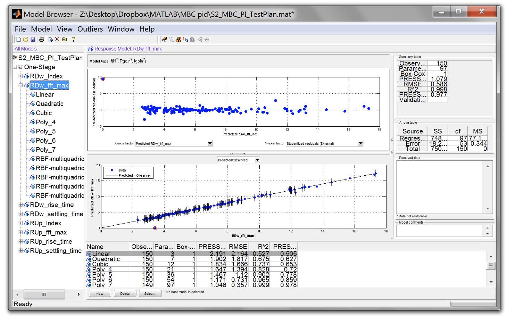
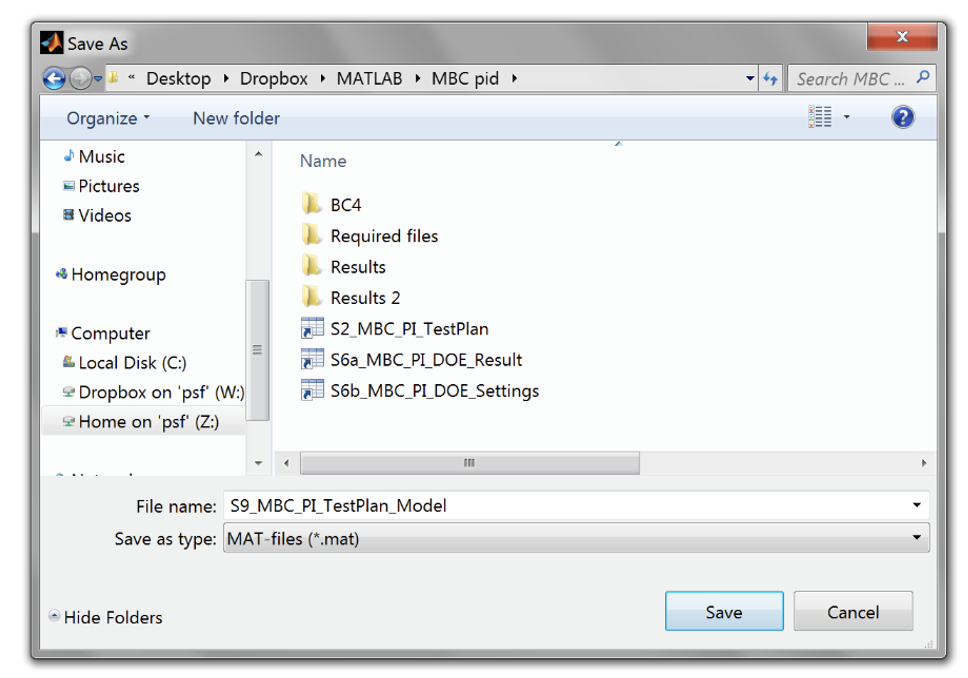
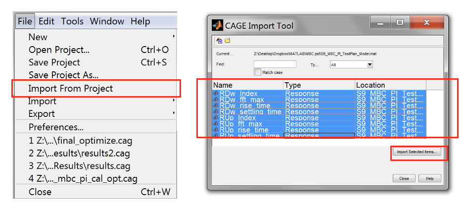

# Lab 7: MBC Based PI Controller Calibration

{: .no_toc }

<details close markdown="block">
  <summary>
    Table of contents
  </summary>
  {: .text-delta }
1. TOC
{:toc}
</details>

## Topics

{: .no_toc }

- Aims and Objectives
- Overview of Exercise
- Background Information
- Exercise 7: MBC Based PI Controller Calibration

## Learning Outcomes

{: .no_toc }

By the end of this lesson, you will be able to:

- Calibrate a PI controller using the Model-Based Calibration method

## Aims and Objectives

This workshop manual shows the procedure of calibrating a PI controller for a fuel transport delay plant using a Model-Based Calibration method. The PI controller is used for controlling the injected fuel mass flow depending on the lambda set point input.

The outcome of the automatic calibration process is a series of optimized gain scheduled tables for the fuel PI controller. This workshop manual is to prove that there is a fine line between calibrating a statistical and dynamical system using the Model-based Calibration method. It also shows that this method is not limited to a PI controller, and may also be used for other time-variant systems.

## Overview of Exercise

Calibration flowchart:


## Background Information

Model-based calibration (MBC) is a systematic method to calibrate an engine control unit. Due to the working principle of MBC it is designed and featured towards the calibration of steady-state systems (time-independent models). This limits the use of MBC because a real ECU contains both statistical and dynamical (time-dependent) systems which require time-intensive manual tuning. With the increasing popularity in hybrid and electrical vehicles (whose powertrains are governed disproportionately by dynamical behaviours), MBC is bound to be superseded by manual parameterization methods.

Despite these limitations, MBC may be applied to systems that are not steady state systems by imposing some assumptions. This can be achieved by separating out the time factor of a system and producing a statistical representation of its behaviour from a time series measurement. Typically, an MBC model is conceived as the representation of a system plant (i.e air path, fuel path, mean value engine model), but is not limited to this very "physical" mode of analysis. It can also model overall system performance by modelling it as a controller. A by-product of this approach is that the time factor is removed from the controller’s performance results. This enables the MBC to model the system performance and optimize the controller’s parameters. The specifics of this approach will be demonstrated in the following exercise.

The benefits of modelling a system’s performance using the MBC approach are realised by employing radial basis function networks, which is known for its modeling accuracy for highly non-linear systems.

### Exercise Files

The files used and generated from this exercise are structured enable easy tracking of progress in the MBC-PI controller calibration. Each of the files is assigned a S# prefix. After the calibration is complete, the file structure should appear as shown below:


File descriptions:

- S2: Save test plan
- S3: Exported DOE sequences
- S4: Script to load/extract DOE design from .csv file
- S5: Simulink model to get controller responses (Fuel delay model)
- S6a: Saved step responses in .mat format file.
- S6a: Saved DOE settings file, which is used to calculate the window duration.
- S7: Script to filter/window and analyze the step responses
- S8: Analysed step response results
- S9: Saved final cage workspace
- S10: Save optimization results
- S11: Exported tables

The files required to complete this exercise are available for download [here]({{ site.url }}/ttp451-module/files/Exercise_7.zip).

### Plant Model

The plant for this exercise is a fuel transport delay model. The model consists of a mapped dead time and transport delay values across a range of engine speeds at full load. The model represents an SI 4-cylinder engine.


### Simulation Environment

This workshop manual uses a simulation environment to introduce the concept of calibrating controllers using the MBC approach. In actual application, the simulation environment may be replaced with ECU calibration software, an actual powertrain and data acquisition software.

For large experimental designs, a DOE sequencer is necessary to run the setpoints. In an engine test bed system such as AVL PUMA or Bobcat, the sequencer can be programmed in the test bed system itself. However, for vehicle calibration applications, a custom program/script may be required and the program should be able to override the controller parameters as well as the plants operating range.

The Simulink blocks and scripts used in this workshop manual may be reused for other applications, though the  application should be confined to calibration of a PI controller on test bed only. The figure below shows an overview of the simulation environment.


#### DOE sequencer block

A sequencer block runs each of the DOE sequences. Currently, the sequence is programmed to run at fixed steady-state time. The sequencer uses a two-state MBC approach where it uses outputs global counter for adjusting the operating variables i.e. speed, P gain and I gain and local counter to adjust the lambda sweep profile. For future improvements, it will include steady-state detection for breaking the cycle loop.


#### DOE block

Assigns a DOE array from the MATLAB&copy; workspace and uses the sequencer output to test each of the DOE sequences.

#### Variables override block

To enable/disable override switch (open loop or closed loop) and to channel in transient cycles for closed loop testing. It also contains the P and I gain maps. PI controller: A basic custom PI controller block which allows for overriding its gains in real time.

#### Fuel delay model block

A plant to simulate the fuel delay transport in an engine’s fuel path.

#### Data monitoring

To provide the test status and to record the DOE settings and DOE test results. The figure below shows the list of recorded data.


---

## Exercise 7: MBC based PI controller Calibration

There are eight tasks in this exercise;

- Create test plan
- Create DoE test points
- Load DoE
- Run test in simulation environment
- Analysis
- Controller performance modelling
- Controller calibration optimisation
- Gain map update

---

### Task 7-1: Create test plan

- Start model browser by typing ``<mbcmodel>`` in the command window. Create a one stage test plan by right clicking on the [Untitled] project node and clicking [New Test Plan]. Select one stage plan. Click [OK] to make the selection.
  


- Double click the “Input” diagram, set “Number of factors” to 3 and enter the following settings as shown in figure below for “min”, “max” and “signal” columns in the setup window.
  


- Save the project as “S2_MBC_PI_TestPlan.m” by clicking [File >> Save Project As].
  


---

### Task 7-2: Create DoE test points

- Right click on the model icon in “Test Plan” pane and select “Design Experiment”. The “Design Editor” window will appear. This where the DoE points can be created and constraints can be applied for known systems.
  


- Create new test design by clicking on the toolbar [File >> New Design]. An empty design called “Linear Model Design_1” will be created in the “Design Tree” pane. The design table will list down all the created test points. If the 3D projection doesn’t appear, click on the toolbar [View >> Split View >> 3D Design Projection]. The 3D design projection will show the points that have been created.
  


- Create constraints for the two gain variables. Go to [Edit >> Constraints] and click [Add]. Set the Y factor to “Pgain” and Inequality to “>=”.
- Delete the constraint breakpoints leaving only the two minimum and maximum breakpoints. To do this click “Remove point” button and click a breakpoint to remove it.
- Set the breakpoints as shown in the figure below. Do this for “Igain” variable. Once finished, click [OK] to close the Constraints window.


- Now create a Sobol design by clicking [Design >> Space Filling >> Sobol] sequence
  


- Set the number of design sequences to 350 and click “OK” to start to generate Sobol sequences.


Once the DoE points have been generated, the “Design Editor” will load the DoE points in the “Design Table” and “3D Design projection”.

- If the 3D projection doesn’t appear, click on the toolbar, View >> Split View >> 3D Design Projection. The 3D design projection will show the points that have been created.
- Export the design, so that it can be used for engine testing at the test bench. To export the design, click the toolbar [File >> Export Design]. Save as *.CSV format and name it “S3_MBC_PI_DOE_seq.csv”.
- The csv file might be located in Matlab root folder by default, change the save file location for easier file retrieval. Now, close the design editor.


Note: For this exercise, the DoE test points were designed for an unknown system (No knowledge of the engine limits). For that reason, no constraints will be used for this exercise.

In practice knowledge of constraints may come from engine modelling or early tests of an engine prototype.

---

### Task 7-3: Load DoE

- Open “S4_MBC_PI_Load_DOE.m” script. Make sure the name of DOE export file is the same as in the script. If ok, run the script. DOE will be automatically loaded into workspace. This variable contains the set points for engine speed, P gain and I gain generated from the DOE process.


---

### Task 7-4: Run the Test in Simulation Environment

- Open “S5_MBC_PI_Control_Auto_DOE_V4.slx” Simulink model. Double-click Counter block and set the number of DOE sequences to 150 (set according to the number of DOE sequences generated). Leave the DOE sequence period, DOE local sweep and stabilization as default. If necessary adjust the local sweep, add more step response if required.
- Double-click DOE test points block and make sure the DOE table name is the same as the one loaded into Matlab workspace. Leave DOE column selection as default because we have only three columns to choose from the DOE sequences file.
- Check the overrides setting as shown below. Make sure all overrides are set to “1” to use DOE sequences (open-loop control).


- Run the simulation. The simulation will stop when it has finished cycle DOE no 150.
- The measurement files are saved as:
  - S6_MBC_PI_DOE_Result – DOE and step response measurements
  - S6_MBC_PI_DOE_Settings – DOE sequencer settings


---

### Task 7-5: Analysis

- Open “S7_MBC_PI_Analyse_V3.m” and run the script. Select [Option 1] to load the relevant files. First, load the DOE measurement file and DOE settings file.
  


- To view a specific range of the measurement file, select [Option 3] and choose a valid measurement range.
  


- To view windowed DOE, choose [Option 4] and specify the DOE range required for display. This option will display all ramp up and ramp down for the selected DOE.


- Now, analyse and save the analysed windowed results by selecting [Option 5] and [Option 6]. Once finished, close the analyser.


- The script saves a csv file containing the step response information (settling time, rise time, oscillation FFT and oscillation index).



---

### Task 7-6: Controller performance modelling

- Use the previous design browser setup in Step. Click [Select Data] Icon to open the “Data Selection Wizard”.
- Click the [File Open] icon to start the “Data Import Wizard”.


- Load the “S7_MBC_PI_Analyse_V3.csv”. Leave the “Open As:” as “Auto” and click [Next]. When prompted to confirm Delimited Text File format, press [OK]. A summary of the loaded data will appear, click “Finish” to end the wizard. Then, click [Next] in “Data Selection Wizard” window.


- Assign the input names according to the data signals. The program will automatically assign the names; since the test bed data names are the same as the input names. Click on each of the names in the “Model input factors” and compare with the ones in the “All data signals”. Click “Next” when all the variables are correctly assigned.


- Then, add all signals to the responses list. Click “Finish” when done.


- Close the Data Editor to accept the measurements. Click [OK] to confirm the changes to the project.


- Click on the first response model and go to [Model >> Summary Statistics]. Check the $$R^2$$ and PRESS $$R^2$$ in the Summary Statistics and click [OK].


- For all responses create models using the build tool.  For polynomial models, the build tool will automatically include necessary interaction order. Create polynomial up to 7th order and with “Minimize PRESS” stepwise. Choose the selection criteria “PRESS RMSE”.


- Again for all responses, create radial basis function models using the build tool.  Create RBF with number of centers, ``<linspace(10,075*nObs,5)>``. Choose the selection criteria [PRESS RMSE].


- Some of the responses may have a relatively high degree outliers. Check for each responses and determine which of them require outlier removal.


- To remove, click the best model of the affected response model and expand to view its sub-models. Click on the best model (shaded).



- Go to Outliers>>Remove Outliers. The outliers will be removed automatically.


- The best model need to be reselected manually. Previously it was done automatically by setting the selection criteria in step no 6 and 7). To do this manually, click on the response model and click [Select]. This will open Model Selection window. Select the best model from the list and click “Assign Best”. Click [Yes] to confirm the best model selection. The window will close automatically.


- It is recommended to use a model up to 3rd polynomial or use a radial basis function model. High polynomial order can cause serious over-fitting issues. For this exercise the best is to use radial basis function model even though some polynomials show better results.
- Save the test plan by clicking [File>>Save Project As]. Name the file as S9_MBC_PI_TestPlan_Model.mat. Leave model browser open so that cage can automatically import the response models.



---

### Task 7-7: Controller calibration optimisation

- Start CAGE, by typing ``<cage>`` in the Matlab command window. In the toolbar, go to [File >> Import] from project. The models from the model browser will load automatically. Select all models (“shift + left click” each item) and then click [Import Selected Items]. When prompted to confirm importing the models, click [OK]. Then, click [Close].




- The models should appear as below. The connections show the relationship between the input variables and the response model. Observe the response surface curve by clicking each of the models.


- Create new 1D table by clicking File>>New>>1D Table…. Create two 1D Tables for Pgain and Igain with 6 rows and engine speed as input.


- Now, set up the optimisation by clicking [Tools >> Create Optimisation].
  


- Create a single optimisation objective using foptcon method. Set the optimization as shown below. Let Pgain and Igain be the free variables.
  


- Now, add a constraint to control the oscillation of the step responses. Set the constraint as shown below. Click “OK” when done.
  


- Now, run the optimization by clicking [Run Optimisation]. Wait until the optimization progress bar disappear. The results will be shown on the Optimization Results pane.
  


- The optimisation results pane shows the optimization results. The green marker shows the breakpoints are successfully optimised.
  


- To export the gain tables, go to [File >> Export >> Calibration >> All Items]. Change the calibration format to *.csv and click [OK].
  


- Finally, use the saved gains table and test it in closed loop mode in Simulink. Compare the step response results using the MBC-PI analyser script.


---

### Task 7-8: Gain map update

- Open P and I gain tables in Simulink. You can find the tables in the following subsystem.


- Update the tables using P and I gain from CAGE optimised results.


- Change the override settings from “DOE” to “Override” to enable the PI controller in close loop mode.


- Now you can use your own block (i.e 1D table, signal builder, etc) to replace the speed and lambda override input block to run a transient cycle.


- Try different optimisation objectives and observe the results.
- Step response information such as overshoot, peak, etc are available in the script. To retrieve the information, the script will need some modifications. The controller’s performance are evaluated from the following code:

```matlab
% Get the step response
S = stepinfo(dc(:,3),dc(:,1),doe_profile(k,2));
[maxValue, indexMax] = max(abs(fft(dc(:, 3) - mean(dc(:, 3)))))
```

The data analysed from the windowed step responses are:

- Settling time
- Rise time
- FFT rating (to check stability)
- Oscillation index (to check stability)

The figures below show how the window array is assigned and how to access the window array for data retrieval.


