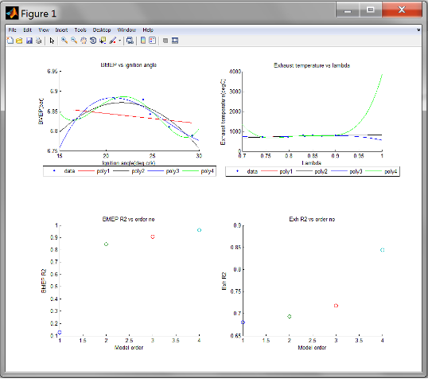
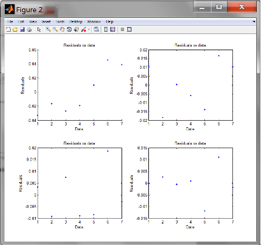
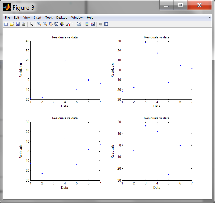
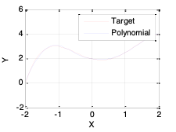

# Lab 3: Modelling Principles
{: .no_toc }

<details close markdown="block">
  <summary>
    Table of contents
  </summary>
  {: .text-delta }
1. TOC
{:toc}
</details>

## Topics
{: .no_toc }

- Aims and Objectives
- Overview of Exercise
- Exercise 3: Modelling Principles

## Learning Outcomes
{: .no_toc }

By the end of this lesson, you will be able to:

- Identify correlations between data streams
- Apply regression methods to engine data
- Fit a surface that describes the data and allows evaluation
- Fit time series response data with radial basis functions

## Aims and Objectives

The aim of this exercise is to investigate the creation of different forms of models. A few common types of model will be discussed, notably polynomial and radial basis functions (RBF’s). Also, the user will gain expertise in some common Matlab&copy; functions and the constructs that Matlab&copy; facilitates.

## Overview of Exercise

Once data has been acquired during an engine test, the first step in handling the data is the creation of a model.  The reason for developing a model is to allow ready access to the data since it is now represented in a functional form; also, it allows interpolation because the tests are conducted at discrete points, and for the calibration process, data must be available at all possible values of the controlled parameters of the engine.

There are many forms of model and in this workshop we will consider just a few of the more commonly used types, notably polynomial and radial basis function (RBF) models.  We will also take a look at a very simple model type that is useful in searching for relationships between data streams – cross-correlation.   The surface fitting example illustrates the utility and importance of data visualisation.  

The other purpose of the workshop is to give you an opportunity to practice some commonly needed skills in the use of Matlab&copy; functions and the constructs that Matlab&copy; facilitates.

The exercises consist of the following:

- Linear correlation – is there a relationship between two streams of data?
- Applying regression methods to engine data
- Fitting a surface that describes data and allows the data to be evaluated
- Fitting time response data using radial basis functions.

Files required for this modelling workshop are located in “TAS 2017>>3. Modelling lab ” folder:

- RBF_manualtune_V3_exercise.m
- V8NA_model_lab_TestBedData.csv
- Note: Save these files in your Matlab&copy; current folder or set the current folder to in “TAS 2015>>3. Modelling lab ”, whichever is more convenient.

The test data is provided by JLR and is in the form of a spreadsheet, generated during tests of a V8 DI spark ignition engine. The test data are saved in V8NA_model_lab_TestBedData.csv.

You can load the data into Matlab&copy; using the import command (Matlab&copy; file submenu), then use the construct: ``<mydata = data(:,n)>`` to extract the nth column.

### Exercise 3: Modelling Principles

There are 5 Tasks comprising this lesson:

- Exercise 1: Testing xcorr
- Exercise 2: Sorting and filtering data
- Exercise 3: Fitting and error evaluation
- Exercise 4: Creating a surface plot
- Exercise 5: Tuning a system of RBFs

---

#### Task 3-1: Testing ``<xcorr>``

Test the xcorr function using the following example:

```matlab
x = 0:0.01:10;
X = sin(x); 
Y = cos(x); 
[r,lags]=xcorr(X,'coeff'); 
plot(lags,r)
```

Evaluate the correlation that may exist between the following pairs of data streams.  In each case comment on the physical significance of the result.

- AFR (column 9) and exhaust temperature (column 11)
- Exhaust temperature (column 11) and BMEP (column 13)
- Use the function detrend to remove the mean value of the data before running the xcorr function.  Why is this necessary?

---

#### Task 3-2: Sorting and Filtering Data

Sort and filter V8NA_model_lab_TestBedData.csv in the following order:

- Extract data for speed = 3500RPM
- Relative engine load 50-57%
- Remove BMEP_mean < 6.79

You can use ``<sortrows>`` array to sort the data array. Do not override the original test data. Use Matlab&copy; to do the sorting. Identify a polynomial function that relates respectively:

- BMEP (torque) [y] and ignition timing [x]
- Exhaust temperature [y] and AFR [x]

Start with a second order model and seek an R-squared value of above 0.95, and once you have identified a satisfactory fit, plot the resulting function and the residual values.  How can you test the residuals to give an impression of the quality of the model?

---

#### Task 3-3: Fitting and Error Evaluation

Create 2 sub-functions which calls the fitting functions and error evaluation code. The fitting sub-function requires:

- Input 
    - Ignition for BMEP response - ``<mydata(:,6)>``
    - Lambda for Exh temp response - ``<mydata(:,9)>``
- Output
    - BMEP response data - ''<mydata(:,13)>``
    - Exh temp response - ``<mydata(:,11)>''
- Polynomial order – n
  
Loop the sub-function four times for generating polynomial from 1st to 4th order. The fitting models are stored in a cell array and the predicted responses are stored in multidimensional array. See coding below.

A 2nd sub-function is to calculate the $$R^2$$ and residuals. This sub-function requires actual output data from mydata and prediction output from fitting sub-function. This error sub-function will give out the R^2 and residual values which is stored in multidimensional array.
The main body of the &copy; code stated above should be as below (You can find this main body code in “TAS2015 >>3. Modelling lab>>polyfit_lab_v3.m”:

```matlab
function polyfit_lab_v3()

%-----   csv read - Follow step 2
%-----   data filter - Follow step 3
%-----   data sort - Follow step 4

for n=1:4
[BMEP_poly{n}, BMEP_data_poly(:,n)] = poly_fitting(mydata(:,6),mydata(:,13),n);
[Exh_poly{n}, Exh_data_poly(:,n)] = poly_fitting(mydata(:,9),mydata(:,11),n); 
end

%Calculate R2 and residual
for n=1:4
[R2_BMEP(:,n), resid_BMEP(:,n)] = error_evaluation(mydata(:,13),BMEP_data_poly(:,n));
[R2_Exh(:,n), resid_Exh(:,n)] = error_evaluation(mydata(:,11),Exh_data_poly(:,n));
end

%-----    Plot functions - Step 5(Create your own code)

function [model, model_predict] = poly_fitting(input,response,n) 

switch n
    case 1
        poly_order = 'poly1';
    case 2
        poly_order = 'poly2';
    case 3
        poly_order = 'poly3';
    case 4
        poly_order = 'poly4';
end

model=fit(input,response,poly_order);
model_predict = model(input);

function [Rsqred, resid] = error_evaluation(actual_data,predict_data)
resid = actual_data - predict_data;
SSresid = sum(resid.^2);
SStotal = (length(actual_data)-1) * var(actual_data);
Rsqred = 1 - SSresid/SStotal;
```

- Call the data file and store into mydata array. Use the following code to do this. But first assign the filename to a string called filename.

```matlab
mydata = csvread(filename,2,0, [2,0,1050,14]);
```

- Use filter to remove data. For example, to filter the engine speed:

```matlab
%Filter data
mydata(mydata(:,2)<3500,:)=[];>);
```

Refer to the question for a complete list of filters required to get the data. 

The data is filtered because it was developed using a DOE method. So, the points are scrambled in all directions in the operating space. Filtering narrows down the data to the area of interest which is to observe the trend of BMEP across ignition angle and exhaust temperature across lambda.

- Use sortrows to sort the column according to BMEP (column 13).

```matlab
%Sort ignition angle column 13
mydata = sortrows(mydata,13);
```

- Generate plots for:
  - Comparison between polynomial orders for both responses (BMEP and exhaust temperature)
  - R2 plot for all responses. Use ``<plot cfit>`` function to plot a fitting curve.
  - Residuals for all responses. To reduce the coding, use for loop to iterate the plot functions for all polynomial orders.







---

#### Task 3-4: Creating a Surface Plot

In this exercise, you will create a surface plot using the example data using poly(cfit) function.

The objective is to identify for each (speed, load) pair, the minimum exhaust temperature, then to plot the data as a surface.  Please check the notes in the Appendix for assistance with the usage of surface fitting functions.

Use the following code to get started:

```matlab
SPEED = mydata(:,2);
LOAD_CMD = mydata(:,14);
LOAD = mydata(:,13);
EXTEMP = mydata(:,11);

SL = unique([SPEED, LOAD_CMD], 'rows');
nRuns = size(SL, 1);

maxEXTEMP = zeros(nRuns, 1);
Load = zeros(nRuns, 1);
Speed = zeros(nRuns, 1);

for i = 1:nRuns
    idx = SPEED == SL(i,1) & LOAD_CMD == SL(i,2);
    maxEXTEMP(i) = max(EXTEMP(idx));
    Load(i) = mean(LOAD(idx));
    Speed(i) = mean(SPEED(idx));
end
```

Use the fit command to plot the surface.

```matlab
f1 = fit([Speed, Load], maxEXTEMP, 'Lowess', 'Normalize', 'on');
```

Note that ``<fit>`` returns an object of type fit that will be used by the plot function to plot the surface. “Lowess” indicates the use of a local regression fit.

Now, try constraining the fitting process by excluding some data. Use the following code:

```matlab
out = excludedata(Speed, maxEXTEMP, 'Range', [400, 700]);
f2 = fit([Speed, Load], maxEXTEMP, 'Lowess', 'Normalise', 'on', 'Exclude', out);
```

Please check the manual entry for fit for a listing of the other model types.  Try a polynomial and cubic surface and explain the similarities and differences.

---

#### Task 3-5: Tuning a System of RBF’s

In this exercise you will tune a system of Gaussian radial basis functions to represent a complex function between two variables. 
A function, $$y=-0.25x^4+0.42x^3+x^2-0.67x+2$$, is to be modelled using Gaussian radial basis functions. The function is to be represented by five individual functions, you must tune each of the width, the centres and the weights in order to get a good fit to the function.  We will give you the function as the m-file, RBF_manualtune_V3_exercise.m in “TAS 2017>>3. Modelling lab” folder. 


Note that in practice you would fit the RBFs to data.  We have given you a function to make the exercise straightforward to complete. At the end of the workshop we will distribute a model answer.

Then, use the Matlab&copy; function ``<newrb`` to fit the RBF, ``<newrb>`` returns a function that can be used to evaluate the function.  Simply use that function with the input values to generate the outputs. See coding below:

```matlab
%RBF configurations and targets
err = 0.02; %RMSE target
wd = 1;     %RBF widths
n = 5;      %No of centers

%RBF network
net = newrb(x,T,Err,wd,n);
Y=net(x)
```

Next, plot the results to compare between target function and optimized RBF.



With an interaction level of 1, there are no terms in the model involving more than one factor. For example, for a four-factor cubic, for factor $$L$$, you see the terms for $$L$$, $$L^2$$, and $$^3$$, but no terms involving $$L$$ and other factors. In other words, there are no cross-terms included.

If you increase the interaction level to 2, under second-order terms you see $$L^2$$ and also $$L$$ multiplied by each of the other factors; that is, second-order cross-terms (for example, $$LN$$, $$LA$$, and $$LS$$).

Increase the interaction to 3, and under third-order terms you see $$L^2$$ multiplied by each of the other factors ($$L^2A$$, $$L^2N$$, $$L^2S$$), $$L$$ multiplied by other pairs of factors ($$LNA$$, $$LNS$$, $$LAS$$), and $$L$$ multiplied by each of the other factors squared ($$LN^2$$,$$LA^2$$, $$LN^2$$). Interaction level 3 includes all third-order cross-terms.
