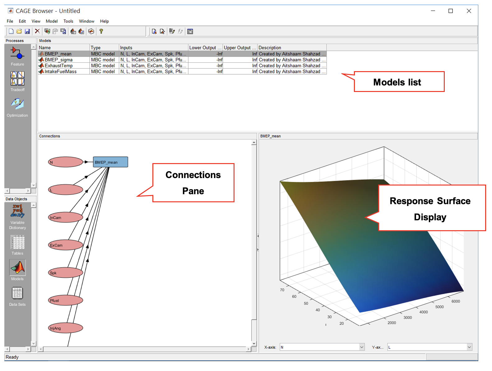
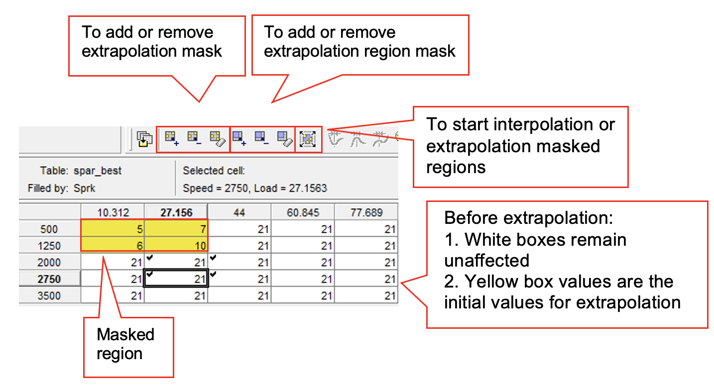
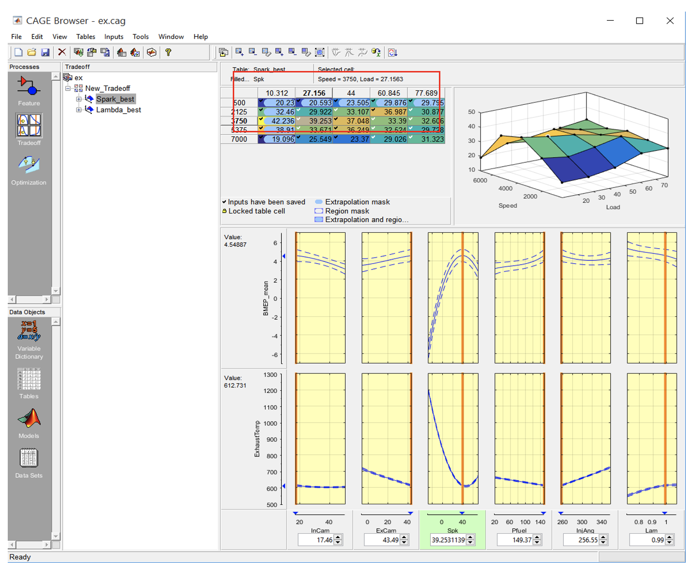

# Lab 6: Calibration Optimisation V8 Engine Example

## Topics

- Aims and Objectives
- Overview of Exercise
- Background Information
- Exercise 6: Optimisation Calibration for a V8 Engine

## Learning Outcomes

By the end of this lesson, you will be able to:

- Use the CAGE tool for analysis purposes
- Perform automated and manual trade-off calibration
- Produce calibration maps

## Aims and Objectives

The aim of this exercise is both to observe and to gain an understanding of the process of calculating engine control parameters.  The exercise uses the data you have already seen during the modelling and Design of Experiments exercises.  The work you completed in the DOE workshop will form the starting point for this exercise. You will use the CAGE tool (CAlibration GEneration) to conduct the analysis.

## Overview of Exercise

The DOE results are transformed into models which are used in a predictive way to support the optimisation process.

There are two aspects to the exercise. Starting with the models you created in the DOE workshop you will set up the optimisation process with the CAGE tool. It is possible to complete the optimisation process automatically, but this leaves you with a limited understanding of the process.  You will attempt a manual calibration process first, observing the effect of manipulating the controlled variables, and getting an understanding of the effect they have on the BMEP value and the exhaust temperature.

You will then proceed with the automatic optimisation. The output of this process consists of the values you would download to an engine management system for testing. At this stage you will plot and evaluate the resulting control scheme. You will explain why the particular pattern of controls was selected.

The calibration you have calculated will meet the steady state performance requirements and indeed this was how the objectives of the exercise were originally set. The timeliness of torque delivery is not addressed and you are asked to consider how you would augment such a steady state control in order to achieve good transient operation.

### Background Information

The complete calibration process begins with formulating the control requirement. Simply stated this is an optimal condition to be achieved using a number of engine actuators. Here optimal refers to a condition that could be represented as a cost function with a number of constraints. In this exercise the conditions are respectively a maximisation of the mean BMEP while at the same time minimising the variation in the BMEP value. These two conditions are subject to the constraint that the exhaust temperature must be less than $$800^oC$$.  Note that these conditions are defined for part load.  The load is defined as a relative load (based on engine air flow).  For this air flow, the AFR, spark timing and valve phasing are varied according to the DOE plan that you studied during the DOE workshop.

---

### Exercise 6: Feature Calibration for a V8 Engine

The workflow for this exercise is as follows;

- Load saved model from previous workshop
- Import models from model browser
- Setup model variables
- Trade-off calibration setup and model selection
- Trade-off calibration maps setup
- Manual Tradeoff Calibration
- Set calibration objectives and constraints in optimisation pane
- Start automated trade-off calibration
- Randomly check the calibrated test points
- Save calibration maps in calibration format

---

### Task 6-1: Load saved model from previous workshop

- Start MBC toolbox model browser, by typing ``<mbcmodel>`` in the Matlab command window. Open the project named “V8NA_1_StageModel.mat” by clicking the toolbar [File >> Open Project]. Leave the model browser open.

---

### Task 6-2: Import models from model browser

- Start CAGE, by typing ``<cage>`` in the Matlab command window. In the toolbar, go to [File >> Import] from the project. The models from the model browser will load automatically. Select all models (“shift + left click” each item) and then click [Import Selected Items]. When prompted to confirm importing the models, click [OK]. Then, click [Close].

- The models should appear as below. The connections show the relationship between the input variables and the response model. Observe the response surface by clicking each of the models.

---

### Task 6-3: Setup model variables

- Rename the inputs variable in the “Variable dictionary” in the “Data Objects” pane. Right click the name and click [Rename]. Rename the variables according to the figure below.

---

### Task 6-4: Trade-off calibration setup and model selection

- Click [Tradeoff] in the Processes pane to start the tradeoff process. Then click [File >> New >> Tradeoff]. The Cage browser will change to tradeoff mode.

Tradeoff List will show the tables that has been created. Tradeoff table properties shows the content and the details each of the tradeoff tables. Available models shows the models that are available for tradeoff, it is basically the model that the user loads. The display model pane lists the models that the user wishes to use in the tradeoff process. The models will be plotted in the intersection plot.

- Select “BMEP_mean” and “ExhaustTemp” models from the “Available Display Models” pane and click the right arrow button. This will transfer the models into the “Display Models” pane. These two models will be used in the intersection plot in tradeoff calibration.

---

### Task 6-5: Trade-off calibration maps setup

- Click [Add New Table] to create calibration tables for the tradeoff calibration. Set the table name to “Spark_best”. Set the rows and columns to 5. The Y-Input should be Speed and the X-Input, Load.  Click [Select] to assign the “Fill table with” value. In the “Select Filling Item” window change the radio button of “List Options” to “Display Variables”. Select “Spk” and click [OK]. Then click [OK] again to close the “Table Setup” window.

Normally in the engine calibration process, the Rows and Columns are set around 16-32 points. Due to the limited time available in this workshop the tables are set smaller so that optimization process  completes within the timetabled period.

- Add another table called “Lambda_best”. Select “Lambda” or “Lam” from the variables list option. Click [OK] to close the table setup.

- The tradeoff browser now should look like the figure below:

---

### Task 6-6: Manual Tradeoff Calibration

- This step explains the steps to perform a manual tradeoff calibration. This method enables the user to adjust the parameters according to the calibration objectives.
- Select “Spark_best” or “Lambda_best” tradeoff table under the tradeoff heading to change the view to the intersection plot. Now, the design browser should look like the figure below.

  The intersection-plot provides the interface to set suitable value for the operating point. By moving the current value line (orange line) for an input variable, all response model output  variables change as well. This shows how each of the variables relates to each other. The text box in the interpolation pane is useful to set the input variable manually instead of using the current value line.

- Turn on the confidence intervals in [View >> Display Confidence Intervals]. The confidence interval should appear as dotted lines in the intersection plot. The intersection plot is an estimated range of values which is likely to include an unknown population parameter.
- To manually calibrate the map, adjust the current value line (orange line in intersection plot). Now, adjust lambda and spark to identify the effect of these variables on the calibrated values.   According to the variable and the direction of the adjustment explain the results.  For example, as you keep increasing the ignition timing, you should see the BMEP maximised and then BMEP_mean will start to decrease while the degree of variation increases.  Try to get the highest BMEP_mean while maintaining exhaust temperature below 700°C by adjusting all the input variables.
- Once satisfied, click [Apply table filling value].  The maps will be updated with the selected value. Calibrate only the first column and first row first of the table.
- Observe the colour changes in the table. Yellow boxes indicate extrapolation mask. These yellow boxes will not extrapolate when you click “Extrapolate using regions”. Now, we will use the unmasked regions and extrapolate it.

- The extrapolation mask is the set of cells that are used as the basis for filling the table by extrapolation. This function helps to prevent large deviation of parameters after each calibrated operating point. Use this function to extrapolate the uncalibrated regions. To start extrapolate the unmasked regions, click on [Extrapolate using regions] button. Notice now, the table has been filled with values.

This function is only for estimating table values and not to be operated on an actual working engine. This technique helps to speed up the manual calibration process by not deviating too much from previous operating point.

You can manually mask a cell by pressing “Add selection to extrapolation mask”. The masked cell colour will change to yellow. The cells outside the yellow will be extrapolated based on the yellow cell values. To start extrapolate, press [Extrapolate using regions]. Try to explore the difference between interpolation and extrapolation. Also, observe how the map contour changes by placing mask at different places in the table.

- For this exercise, the engine needs to be calibrated according to these criteria:
  - Maximum performance (maximum mean-BMEP)
  - Minimum BMEP_sigma
  - Part load region: 0.99 <= Lambda <= 1.01 and full load region: 0.7 <= Lambda <= 0.9
  - Exhaust temperature not to exceed $$700^oC$$ (Constrain exhaust temp at $$700^C$$)
- The criteria need to be set up in the optimization objective and constraints. The tradeoff calibration will use the optimisation objectives in the automated tradeoff process.

---

### Task 6-7: Set calibration objectives and constraints in optimisation pane

- Change the design browser to Optimization view by clicking the [Optimization] button in the Processes pane. Create optimization by clicking on the toolbar, [Tools >> Create Optimization from Model]. From the dialog box, click [BMEP_mean] to design the first criterion in the list above. Click [Next].

- Select the “foptcon” algorithm. This algorithm is normally used for single-objective calibration. Select objective type to “Maximize” and “Point”, so that the BMEP will always be at its maximum. For “Data source”, use “Table grid” and set to “Spark_best(Speed, Load). This is to assign the breakpoint in the calibration table to the optimization objective. Set the free variable by leaving the “Speed” and “Load” unchecked. “Free variables” are the variables that are to be optimized. Leave  “Add a model boundary constraint” unchecked and click [Finish].

- Now set the 2nd criterion by adding a constraint. In the toolbar, click [Optimization >> Constraints >> Add Constraints]. Set the constraint type to “2D Table” and constraint name to “Lambda_upper”. Go to “Input tab” and deselect variables under the Item list. Replace “X-axis” item with “Speed”, “Y-axis” with “Load” and “Z-axis” with “Lambda” or “Lam”.

- Next, go to “Table Editor” tab, set number of breakpoints for X and Y axis to 5, set the “X factor” to “Speed”, “Y factor” to “Load” and “Z factor” to “Lambda”. Change the constraint inequality to more than. Make sure to press [Span Factor Range] for both axis, this step is important to rescale the tables according to the factors range. Lastly, set the table values as in figure below. Press [OK] to confirm and close the window.

To fill-in the table quickly, use ctrl+c to copy and ctrl+v to paste the numbers in the table.

- Now, we want to create an upper constraint. Repeat the same steps as the lower constraint but rename the constraint to “Lambda_upper” and set the table values as in the figure shown below.

  You can duplicate Lambda_lower constraint and simply modify it rather than adding a new one. To do this, right-click on the constraints pane and select Duplicate Constraint.

- Now set the 4th criterion by adding a constraint. In the toolbar, click [Optimization >> Constraints >> Add Constraints] Set constraint type to “Model” and constraint name to “Max_exh_temp”. Select “ExhaustTemp” in the Input model. Set the constraint type to <= because the exhaust temperature should be lower than the temperature limit. Set the Constraint bound to 700. Click [OK] to close the dialog box.

- After setting up the objectives and constraints, the design browser should look like the figure below. Now, the optimization constraints have been created and can be used in the tradeoff.

- Go back to the tradefoff view, by clicking the “Tradeoff” in the Processes pane. Expand the “New_Tradeoff” in the Tradeoff tree and click either “Spark_best” or “Lambda _best” to view the intersection-plot.

---

### Task 6-8: Start Automated Trade-off Calibration

- Click “Automated tradeoff” icon and a dialog box will appear asking the user to select which optimization objective to be used. Select the “BMEP_mean_optimization” and click [OK].

- Another dialog box will appear, asking which points to be optimized, since we are optimizing the calibration globally across all speeds and loads, select “All table cells”. Click [OK] to start the automated tradeoff process. A progress bar will appear indicating the progress of the automated calibration.

  The process might take a while depending on the computer processor’s speed and resources. It should take a few minutes.

---

### Task 6-9: Randomly Check the Calibrated Test Points

- Once the optimization has completed, randomly click on the operating points in the table to check the intersection plot whether the criteria have been met.

---

### Task 6-10: Save Calibration Maps in Calibration Format

- The generated calibration table can be found in “Tables” in the Data Objects pane. The calibration data could be exported to various type of calibration formats such as ATI vision or INCA DCM. To export the calibration tables, click on the toolbar, [File >> Export >> Calibration >> All Items].

  

- Explain the shape of the map and its features.  In particular,
  - How have the different controls been used to achieve the objectives?
  - Have the objectives been universally achieved?  If not why not?  
- Try adding minimize BMEP_sigma optimization objective and observe the outcome of the optimisation. Use NBI algorithm when making multi-optimisation problem.

---
