## Part 1: Introduction to Model Based Calibration

### Introduction

Calibration is a process of performing corrections (correcting parameter values or adjusting lookup tables) to a system until it reaches its target output. In relation to a vehicle or an engine, calibration is a systematic process of fine tuning the internal parameters of the electronic module unit so that the system will behave as required during vehicle operation. In the automotive industry, the calibration process is divided into two areas; engine calibration and vehicle calibration. Normally, in a vehicle development programme engine calibration is performed before the process is progressed to the vehicle team.

For starters, it is useful to think that the electronic control module can serve as a mathematical function. The mathematical function consists of several variables as inputs and constants, the constants of which are stored in non-volatile memory and the output being the product of the mathematical function. A graphical representation of this process is shown below. Calibration is the process that will fine tune the constants and map in the non-volatile memory.

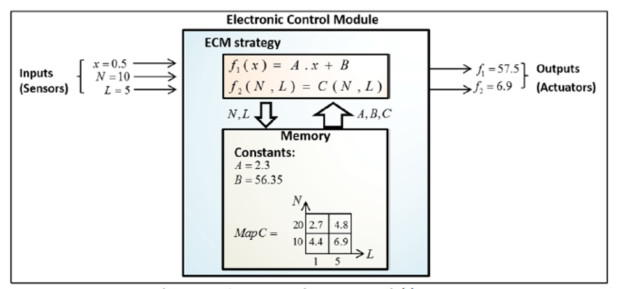

### The Calibration Process

The types of calibration process are listed below:

#### The Conventional Calibration Process

The conventional calibration process tests an engine at all possible points in the engine operating space and the calibration data is manually optimised. The figure below shows the comprehensive engine variable testing points in the operating boundary.

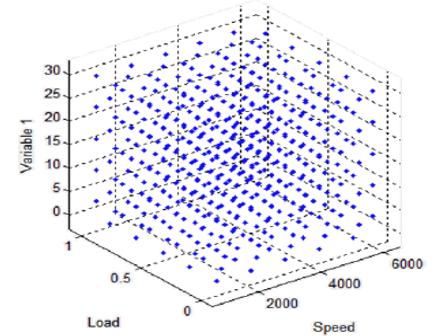

### The Model Based Calibration Process

The model-based calibration process generates test points randomly and places them at critical locations in the operating space generating enough points to accurately represent the behaviour. Using the modelled engine the program can automatically generate optimised calibration data.

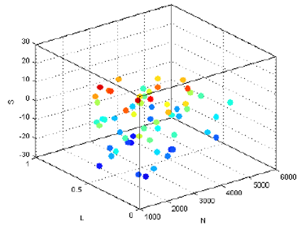

This approach of calibrating the engine efficiently through generation of statistical models and automatic calibration optimisation methods is relatively modern. Model-based calibration helps to:

- Increase efficiency of calibration work
- Provide accurate system modelling
- Save operational cost
- Save experimental time

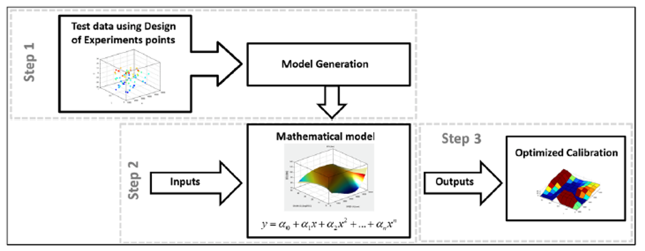

### Comparison between Conventional and Model-Based Methods

The model based calibration method is usually used in conjunction with an automated test bed system which can control the engine as well as the EMS parameters. The figure below shows a comparison between conventional and model-based calibration process.

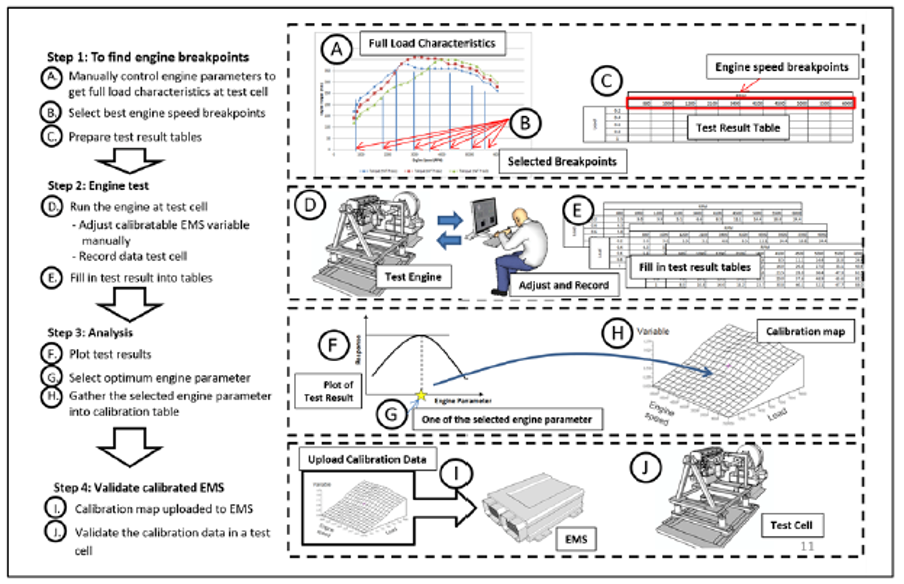

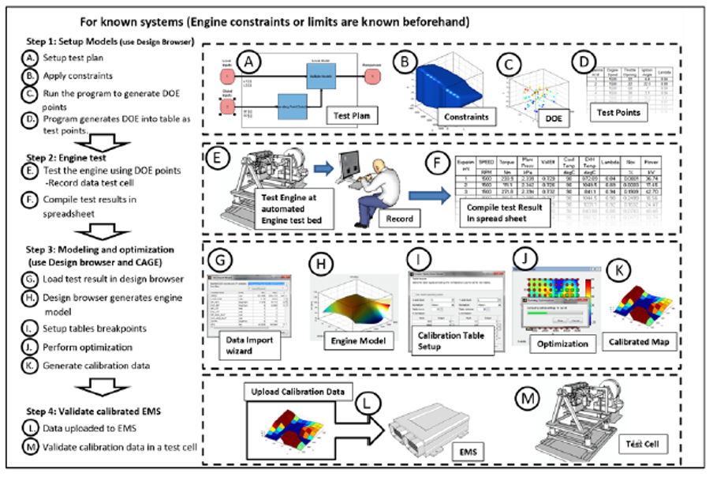

### Drawbacks of the Conventional Calibration process

The conventional method uses the full combination of all variations of the engine variables. This approach usually sweeps all possible combinations in the engine operating range. The illustration below shows the calibration burden for different engine configurations, also known as the curse of dimensionality.

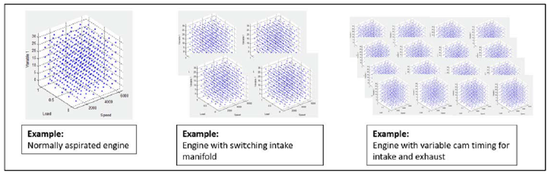

The model-based approach uses a space filling design to randomly spread test points across the engine operating space. By carefully planning the process, constraints can be implemented which create a realistic operating envelope. This keeps the number of points to a minimum and provides relatively good information content.

The model-based approach provides the best compromise between model accuracy and number of test points. Most complex engine designs require the model based approach due to the conventional approach being time consuming which in turn make the process very costly.

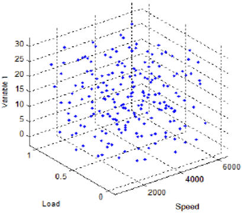

## The Model Based Calibration (MBC) Toolbox

MATLAB&copy; Model-based Calibration toolbox (MBC) is a tool designed specifically to calibrate powertrain systems using statistical approaches and numerical optimization. MBC consists of two components; model browser and CAGE. MBC can:

### Generate DOE (Design of Experiments) – Model Browser (design browser)

DOE points are the experimental test points created in a constrained design space. The number of test points have to be of a sufficient number in order to capture the system behaviour whilst minimising the number of experiments.

### Generate engine model – Model Browser

The Model browser is the GUI (Graphical User Interface) where the system model is created and exported which can be as a Simulink model or a general mathematical model.

### Optimise engine calibration – CAGE

CAGE provides the utilities to perform optimisation of the mathematical model. It offers several different methods of optimisation.

### Fill in empirical models – CAGE (Feature calibration)

Using the modelled response, CAGE is able to fill in empirical models in an ECM. Empirical models are virtual models which replicate the functionality of expensive sensors and instrumentation. Some examples of empirical models are torque models or exhaust temperature models.

### Calibration data generation– CAGE

CAGE converts optimised maps into calibration file format such as for ETAS INCA or ATI Vision.

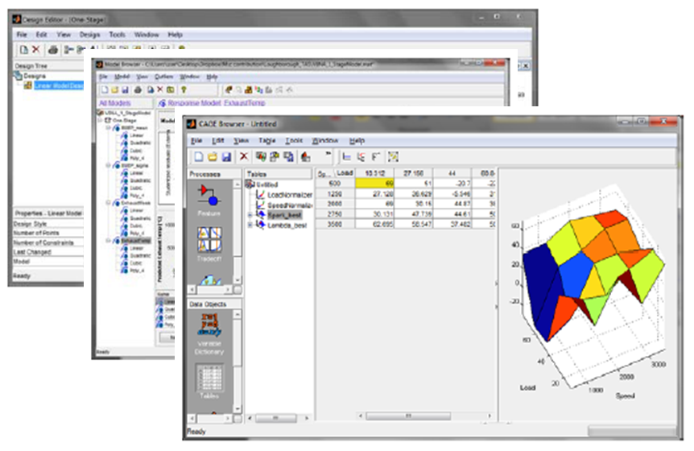

## Starting the Matlab MBC Toolbox

Matlab MBC toolbox comprises of 2 parts:

- Model browser
- CAGE(CAlibration GEneration)

The figure below shows how to start the MBC toolbox in MATLAB using the APPS toolbar:

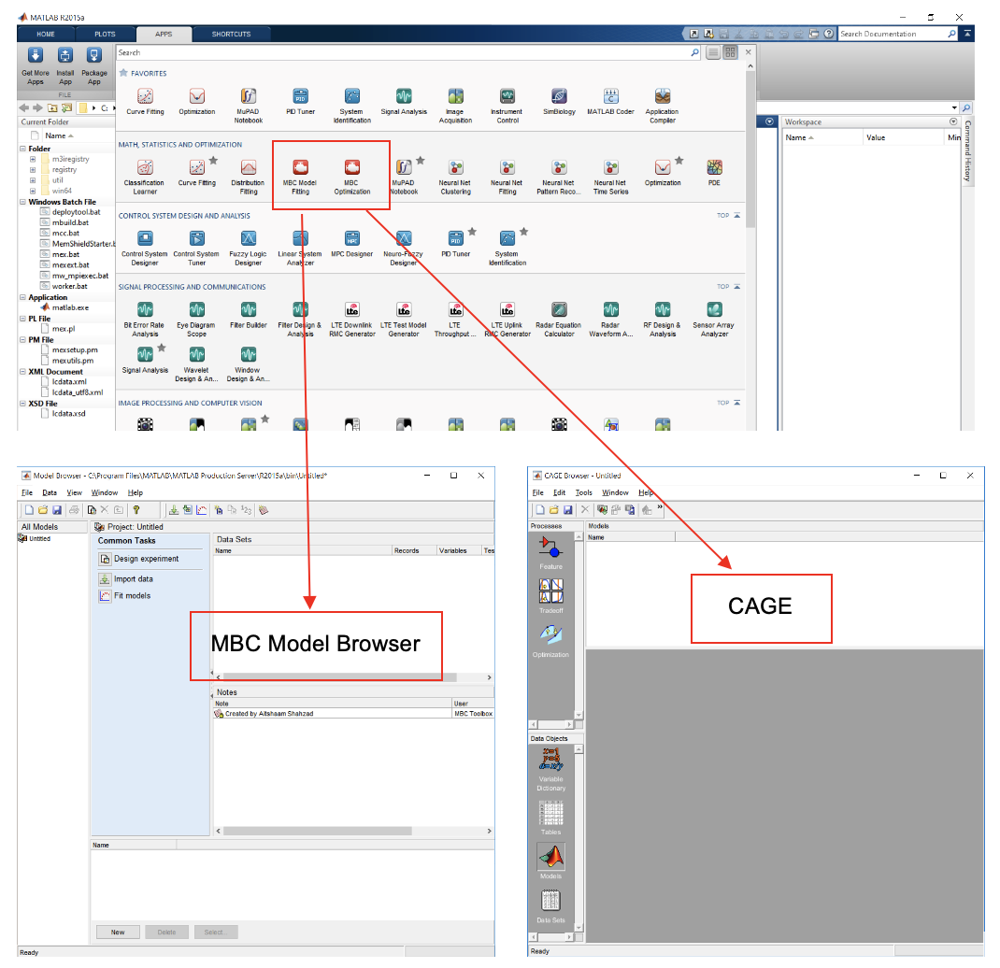

Alternatively, the toolbox can be started by typing ``<mbcmodel>`` for model browser and ``<cage>`` for CAGE in the command window.

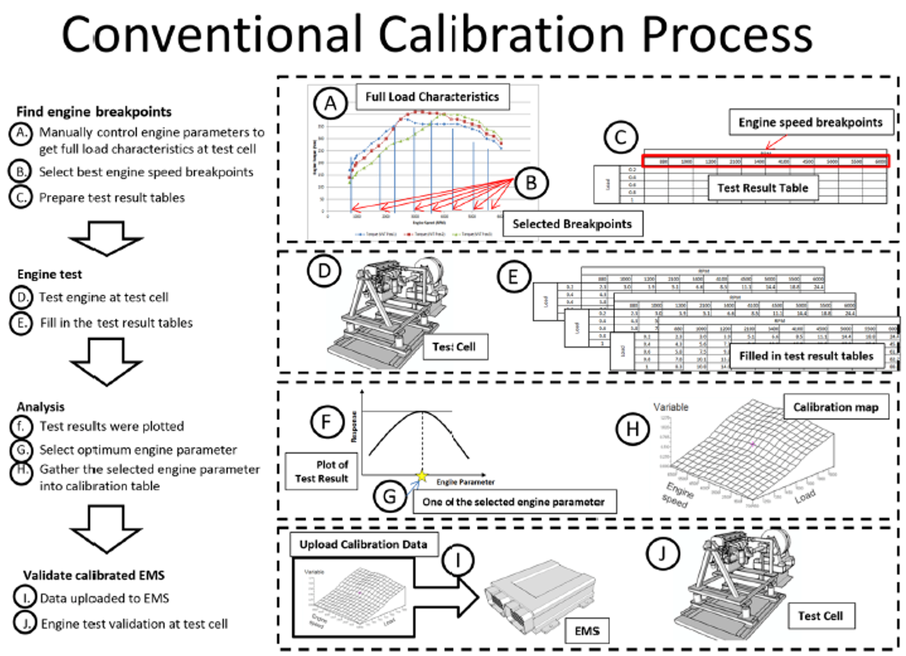

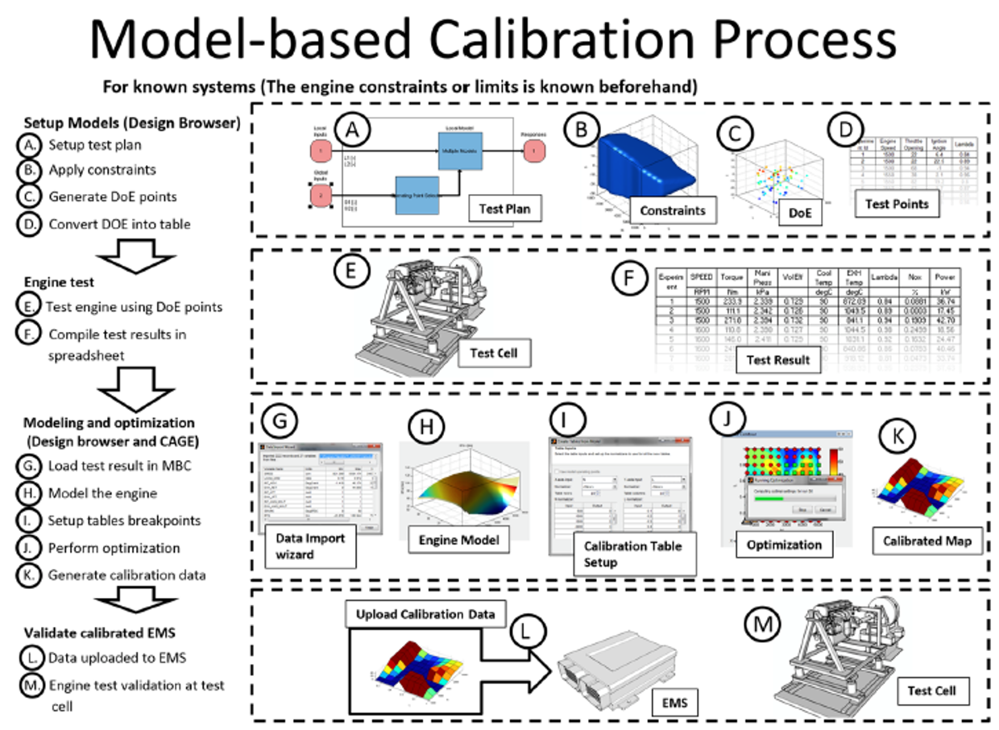

