## Part 2: Design of Experiments (DoE) Workshop – Pre-Study Notes

### Introduction

The advancements in modern electronic sensors, actuators and microcontroller technologies coupled with more and more strict regulations on engine emissions and fuel economy performance have made modern internal combustion engines evolve into a highly complex product with a growing number of controllable variables. Hence, the development of the engine involves substantial calibration work to populate look up tables and other variables (calibration tables”). The Model Based Calibration (MBC) Toolbox in MATLAB helps to dramatically increase the efficiency of calibration, work in saving both time and money. Since the engine models are of high dimensionality and due to the fact it is extremely difficult to develop an accurate physical model, the model used in this toolbox is a statistical model which is constructed using experimental data. The traditional method of collecting large quantities of data by holding each factor constant in turn until all possibilities have been tested is an approach that rapidly becomes untenable as the number of factors increases.

Design of Experiments (DOE) is another function supported by the Model Browser of MBC toolbox. DOE has a long history and has been widely used in research and development in the process sector; anywhere where experiments are complex and costly or time consuming to conduct. The purpose of DOE is to choose a set of experimental points that allow an efficient estimation of the statistical model with the maximum confidence using just a fraction of the number of experimental runs that would be chosen using conventional methods. By efficient it is meant that the experimental effort is matched to the model accuracy.

The Design Editor is an interface of the design of experiment. It provides prebuilt standard designs to allow a user with a minimal knowledge of the subject to quickly create experiments. In Design Editor you can apply engineering knowledge to define variable ranges and apply constraints to exclude impractical points. You can increase modelling sophistication by altering optimality criteria, forcing or removing specific design points, and optimally augmenting existing designs with additional points.

There are three design styles can be selected in the Design Editor: classical, space filling and optimal. Model type has no effect on designs that are space-filling or classical but it is important when considering optimal designs.

### Types of Experimental Design

#### Classical Designs

Classical designs are well developed and are suitable for simple regions (hypercube or sphere). There are five options in classical designs: Central Composite, Box-Behnken, Full Factorial, Plackett-Burman and Regular Simplex.

- Central Composite: Face-Center Cube

The basic type of central composite

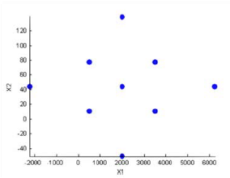

- Central Composite: Spherical

You can arrange the axial design points so that both they and the factorial points lie on the same geometric circle/sphere/hypersphere.

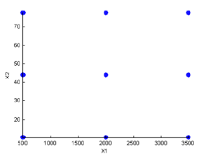

- Central Composite: Rotatable
  
The prediction variance pattern of the design is spherically symmetric, that is, rotating the design in any direction has no impact on the prediction quality of the model that results from the experiment.

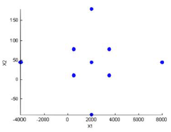

- Central Composite: Custom

You can choose a ratio value (alpha) between the corner points and the face points for each factor and the number of center points to add.

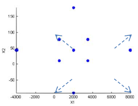

- Box-Behnken

Similar to Central Composite designs but only three levels per factor are required and the design is always spherical in shape. All the design points (except the centre point) lie on the same sphere. There are no face points. These designs are particularly suited to spherical regions when prediction at the corners is not required. You can set the ranges of each factor.

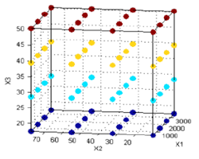

- Full Factorial

Generates an n-dimensional grid of points. You can choose the number of levels for each factor, the number of additional center points to add and the ranges for each factor.

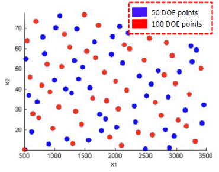

- Plackett Burman\

These are “screening” designs. They are two-level designs that are designed to allow you to work out which factors are contributing any effect to the model while using the minimum number of runs. For example for a 30-factor problem this can be done with 32 runs. They are constructed from Hadamard matrices and are a class of two-level orthogonal array.

- Regular Simplex

These designs are generated by taking the vertices of a k-dimensional regular simplex (k = number of factors). For two factors a simplex is a triangle; for three it is a tetrahedron, greater than that are hyperdimensional simplices. These are economical first-order designs that are a possible alternative to Plackett Burman or full factorials.

#### Space-Filled Designs

Space-filling designs collect data in such as a way as to maximise coverage of the factors' ranges as quickly as possible or spread the points as evenly as possible around the operating space. These designs literally fill out the n-dimensional space with points that are in some way regularly spaced. It should be used when there is little or no information about the underlying effects of factors on responses. In these cases, you are not sure what type of model is appropriate, and are not certain with the constraints either. There are three options in space filling designs: Latin Hypercube Sampling, Lattice design, Stratified Latin Hypercube and SOBOL sequence.

- Latin Hypercube Sampling

Latin Hypercube Sampling (LHS) designs are sets of design points that, for an N point design, project onto N different levels in each factor. In this design, the points are generated randomly. You choose a particular Latin Hypercube by trying several such sets of randomly generated points and choosing the one that best satisfies user-specified criteria.

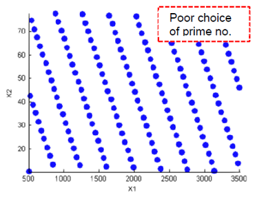

- Lattice

Lattice designs project onto N different levels per factor for N points. The points are not randomly generated but are produced by an algorithm that uses a prime number per factor. If good prime numbers are chosen, the lattice spreads points evenly throughout the design volume. A poor choice of prime numbers results in highly visible lines or planes in the design projections. If all the design points are clustered into one or two planes, it is likely that you cannot estimate all the effects in a more complex model. When design points are projected onto any axes, there are a large number of factor levels. For a small number of trials (relative to the number of factors) LHS designs are preferred to Lattice designs.

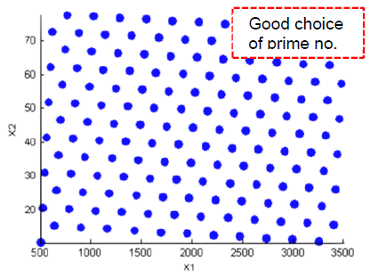

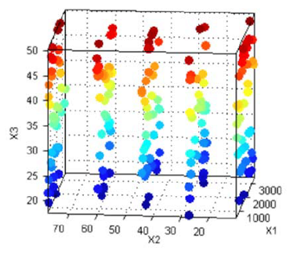

- Stratified Latin Hypercube

Stratified Latin Hypercubes separate the normal hypercube into N different levels on user-specified factors. This can be useful for situations where the preferred number of levels for certain factors might be known; more detail might be required to model the behaviour of some factors than others. They can also be useful when certain factors can only be run at given levels.

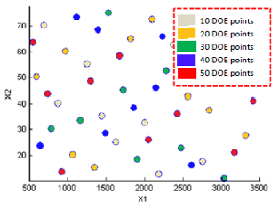

- SOBOL Sequence

Sobol sequences are quasi-random sequences. Quasi-random indicates that test points are scattered in a way that is as close as possible to a purely random distribution. This is a popular choice for powertrain statistical modeling.

#### Optimal Designs

Optimal designs are best for cases with high system knowledge, where previous studies have given confidence on the best type of model to be fitted, and the constraints of the system are well understood. Optimal designs require linear models.

### A Review of Different Experimental Designs

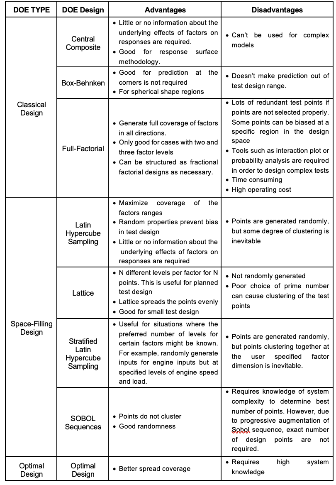

### The Experimental Design Flow-Chart

The DOE lab exercise is split into two parts; the first part of the exercise is to generate DOE points for tests of a diesel engine. This exercise is primarily for familiarization with the MBC model browser GUI and to explore the differences between different DOE designs. The second part of the DOE lab exercise is about generating DOE points for a gasoline V8 engine. This DOE will be used to get engine test data using a virtual engine model. The test results will be used throughout the remainder of the calibration workshops.

The flow chart shows below shows the overall flow for designing a test. The outcome of the process are test points or DOE points which will be used during an experiment.

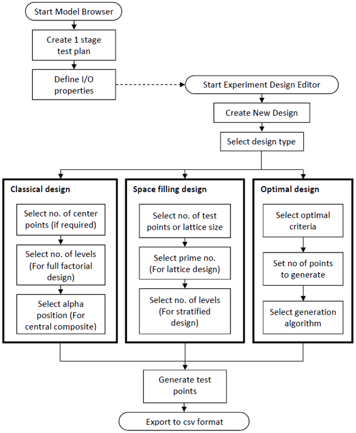

### Overview of MBC Model Browser GUI

It is important to understand the hierarchy of the model browser’s model pane. The views and functionality are different when different levels (or nodes) are selected in the model tree structure. To navigate between the levels, just select the node in the “All Models” pane.

The elements of the tree consist of the following:

- Project node – V8NA_1_StageModel
- Test Plan node – One Stage
- Response node – BMEP_mean
- Global Node – Three Models
- Best Child node – Highlighted Model

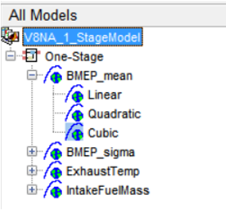

#### Project Level

A default project titled “Untitled” will automatically load at MBC model browser start-up. When a saved project is opened, the “Untitled” project will be replaced. The highest level in the model structure tree is the project level.

In this level, there are three main panes; Data sets pane, Notes pane and Test Plan list pane.

- Data sets pane: This pane allows you to add new data sets (or test results), modify data sets or delete data sets.
- Notes pane: Notes pane is useful to track changes made to a project.
- Test Plan list pane: This pane lists all test plan created for a project. A project can have multiple test plans. For example, a gasoline engine project can have multiple test plans, i.e. fuel ignition model (two stage test plan) and an exhaust temperature model (one stage test plan). This pane can create new or delete a test plan.

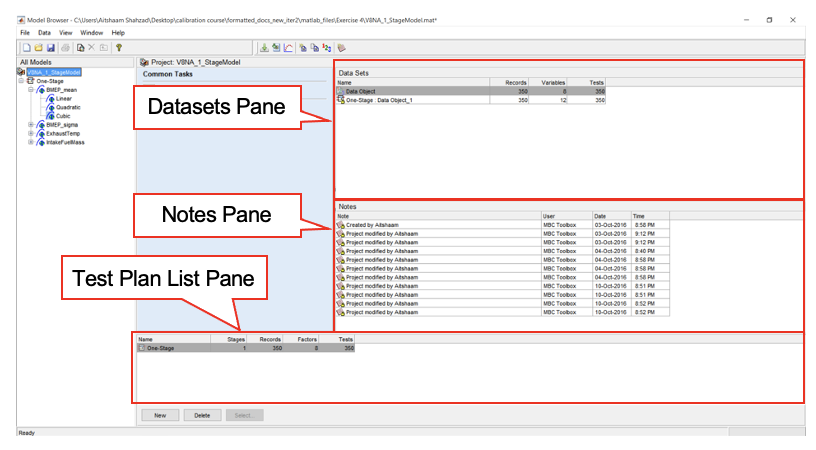

#### Test Plan Level

The test plan node will only appear if a test plan has been selected at project level; otherwise, it would be empty. This level focuses on the planning of a test, in which the user can select one stage plan, two stage plan or point-to-point plan depending on the nature of the experiment. This level is also where the input and outputs of a model can be defined. The test plan level provides test plan pane and response model pane. These panes can be used for:

- Set model input/output
- Set up Model
- Open design editor(for generating DOE)
- View design data
- View model
- Summary statistics

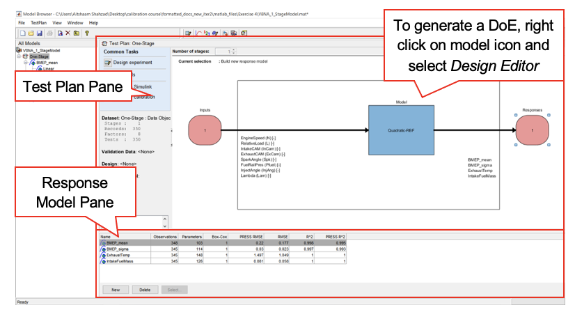

#### Response level

The Response node will only appear if a user has setup the model type and provide a dataset in test plan level. A model is generated based on the initial model setup in test plan stage. In this level, multiple global models (child node) are usually generated and compared with each other. The best model among the global model (child model) can be selected and represented as response model (parent model). This level provides the following functions:

- Build models
- Selecting best model
- Analyse global models
- View modelling data
- View model definition

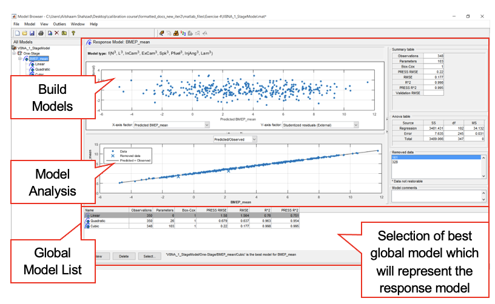
