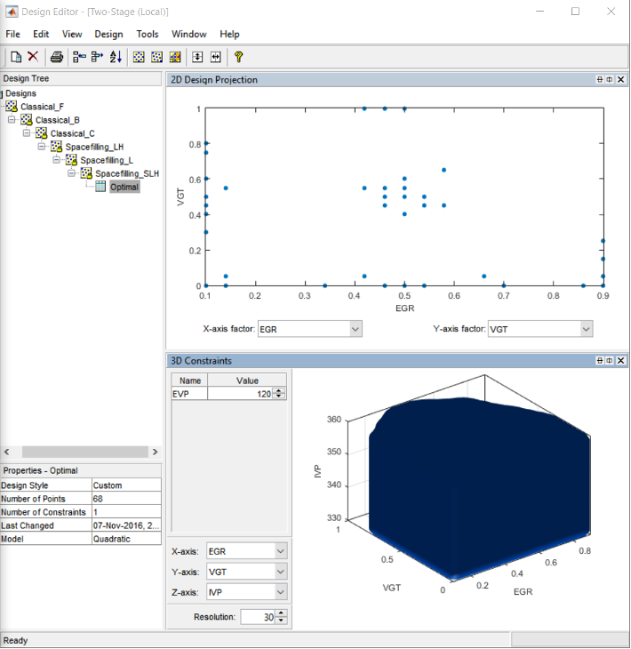

## Part 3: Design of Experiments Laboratory

### Introduction

Use Matlab MBC (Model-Based Calibration) toolbox to design experiments for collecting data (engine performance responses like emission, torque output and fuel consumption etc.). Use three design styles with different options respectively and compare the design results. The progress flow chart for designing an experiment is shown in figure below. Please use the following information to setup the test plan.

Diesel engine’s 6 input factors and operating range:

- Exhaust Gas Recirculation (EGR) Rate: 0.1 – 0.9
- Variable Geometry Turbine (VGT) valve position: 0 – 1
- Inlet Valve Phase (IVP): 330o CA – 360o CA
- Exhaust Valve Phase (EVP): 100o CA – 140o CA
- Engine Speed: 660rpm – 2000rpm
- Torque: 45Nm – 1000Nm

### Pre-Study Exercise: Diesel Example

- Step 1: Start MBC Toolbox Interface

Double-click the MATLAB&copy; icon to start MATLAB&copy;. Enter ``<mbcmodel>`` at the command prompt in MATLAB&copy; to start the MBC Toolbox. If the MBC toolbox has never been used before, the User Information dialog appears. Click [Cancel] or enter your information and click [OK]. Then Model Browser window appears. There is a project node with a default name untitled in the All Models Pane. Change the project node name to “Engine” by clicking on the name and press F2 or right click the mouse then select [Rename] from the menu. Choose [File >> Save Project As] in the menu to save this project with the same name.

- Step 2: Create New Test Plan

Choose [File >> New Test Plan] in the menu or click the New Test Plan button in the toolbar. A model select frame appears. Select [Two-Stage Model] and click [OK], a new Two-Stage node appears in the model tree.

- Step 3: Specify the Input Factor Names and Ranges

Double-click the Local Model Inputs block in the diagram. The Local Input Factors Setup dialog appears; increase the number of factors to four. Change the four input factors to EGR, VGT, IVP and EVP and enter the input factors range as is shown in the figure below. Specify the Global Inputs in the same way.

- Step 4: Creating Classical Design – Full Factorial Option
  
Change the global model to a cubic polynomial. Then, right-click the local model in the diagram and choose Design Experiment or select the item [TestPlan >> Design Experiment] from the menu or click the button Design Experiment in the toolbar, the Design Editor then opens.

Choose [File >> New Design] or click the [New Design] button in the toolbar. A new node called Linear Model Design appears. Click the new node, a 3D constraints draw appears on the right. Rename the new node Linear Model Design to Classical_F by clicking the name and press F2 or right click the mouse then select [Rename Design] from the menu.

Choose a classical design by clicking the [Classical Design] button on the toolbar or choose [Design >> Classical >> Design Browser] then select [Full Factorial] from the Design type dropdown menu.

Increase the number of levels for each factor from 2 to 4, keep the number of center points as 0. The total size of design is 256, you may view your design in different projections using the tabs (1-D, 2-D, 3-D, 4-D) under the display. 1-D: you may select different factor to view each level of this factor. The frequency indicates the number of each level that appears among the all design test points (256). From the view of this design, we may see in full factorial design, the test points are evenly distributed among the factor space.

NB: with 4-D display, the fourth factor is color.

Click the [OK] button to close the Classical Design Browser and return to the Design Editor window. The Design Editor will show the Design Table which includes all the factor inputs combination as result of the design. You may copy the data to other programs such as “Excel” by selecting [Edit >> Copy Design Data] from the menu or right click the mouse on any part of the Design Table and select [Copy]. You may export the design data to MATLAB&copy; workspace or mat file. By selecting [Tools >> Evaluate Designs] the designs can be evaluated using the Design Evaluation Tool window.

- Creating Classical Design Box-Behnken

In the Design Editor window, select the Classical_F design in the design tree by clicking on it. Add a new design. Use the first toolbar button, or select [File >> New Design]. A new child node appears in the tree, called Classical_F_1. The parent node Classical_F now has a padlock on the icon. This indicates it is locked. The tree arrangement lets you try different operations starting from a basic design, then select the most appropriate one to use. The locking of parent designs also gives you the ability to easily reverse out of changes by retreating back up the tree. The new design inherits all its initial settings from the currently selected design and becomes a child node of that design. Rename the new node Classical_B. Select the new design node in the tree. The display remains the same all the points from the previous design remain.

Choose a classical design by clicking the [Classical Design] button in the toolbar, or choose [Design >> Classical >> Design Browser]. A Design Augment/Replace dialog box appears. Choose [Replace the current points with a new design] and click [OK]. The Classical Design Browser appears. Select Box-Behnken from the Design type drop-down menu. Increase the Number of center points from 0 to 1. Then the total size of design is 25. All the design points (except the center point) lie on the same sphere. There are no face points.

- Step 6: Creating Classical Design – Central Composite Option

In the Design Editor add a new child design node to the Classical_B node. Rename it Classical_C. Open the Classical Design Browser on this new node. Choose Central Composite design type. Try selecting different Star point position option to see the change of projection view. When custom option is selected, try change Alpha to see the change of design points.

Click [OK] to close the Classical Design Browser and return to Design Editor window.

- Step 7: Creating Space-Filling Design – Latin Hypercube Option
  
Create another new child design node Spacefilling_LH to Classical_C node. Select this new child node, then open the Space Filling Design Browser by choose [Design >> Space Filling >> Design Browser] from the menu or click the [Space Filling Design] button in the toolbar. In the Space Filling Design Browser window select Latin Hypercube Sampling design type, and try different Selection criteria to see its effect on the design points from the projection view.

- Step 8: Creating Space-Filling Design – Lattice

Create another new child design node Spacefilling_L to Spacefilling_LH node. Select this new child node, then open the Space Filling Design Browser by choose [Design >> Space Filling > Design Browser] from the menu or click the Space Filling Design button in the toolbar. In the Space Filling Design Browser window, select [Lattice] design type and try different Lattice size and Prime number for each factor to see its effect on the design points from the projection view.

Set the Prime number for EGR, VGT, IVP and EVP to 41, 43, 41 and 97 respectively. The 3-D projection view of EGR, VGT and IVP is like that of Figure 20, we may conclude they are poor designs as the designed test points do not cover the whole factor space well.

Change the Prime number for IVP from 41 to 89. The 2-D view of VGT and EGR and 3-D view of EGR, VGT and IVP would like that in Figure 21 and Figure 22 respectively. We may see this is a better design which has the same size as that in the previous step.

- Step 9: Creating Space Filling Design – Stratified Latin Hypercube

Create another new child design node Spacefilling_SLH to Spacefilling_L node. Select this new child node, then open the Space Filling Design Browser by choose [Design >> Space Filling >> Design Browser] from the menu or click the [Space Filling Design] button in the toolbar. In the Space Filling Design Browser window, select [Stratified Latin Hypercube] design type and try different Selection criteria and stratify factor and the stratify levels to see its effect on the design points from the projection view.

Create another new child design node Optimal to Spacefilling_SLH node. Select this new child node, then open the Optimal Design Browser by choosing [Design >> Optimal] from the menu or click the Optimal Design button in the toolbar. In the Optimal Design setting window, set the optimal design parameters to the default settings. Click the [OK] button to start optimizing design process. The optimizing process would stop when the number of iterations without improvement reaches the pre-set value (here is 250) or number of iterations performed reaches the pre-set value in Algorithm tab.

When the optimization process ends, you may see the design table and projection view in the Design Editor window. By right clicking the mouse on the display and select current view to see 1-D, 2-D , 3D or 4-D projection view of the optimal design.

- Step 11: Applying Constraints on Optimal Design
  
Designs can have any number of geometric constraints placed upon them. Each constraint can be one of four types: an ellipsoid, a hyper-plane (or linear), a 1-D lookup table, or a 2-D lookup table. Choose [Edit >> Constraints] from the Design Editor menus. The Constraints Manager dialog appears. Click [Add]. The Constraint Editor dialog with available constraints appears. The default 1D Table is selected in the Constraint Type drop-down menu. Select X factor EGR and Y factor VGT. Move the large dots (click and drag them) to define a boundary.

Click [OK]. Your new constraint appears in the Constraint Manager list box.

Click [OK] to return to the Design Editor. Click the[Remove] button to return to the Design Editor. In the 3D constraints draw pane you can see the 3D constraints. You may try applying other constraint types.

If your current view is 3D projection, change it to 3D constraints by clicking [View >> Current View >> 3D Constraints].

It is best to set up constraints before making designs. For optimal design this ensures that the design points are optimally chosen within the area of interest only.

- Step 12: Point Augmentation on Optimal Design

Select the Optimal design, view the 2D projection of EGR and VGT.

Choose [Edit >> Add points] in the menu. The Add Design Points Window appears. Among the five available Augment methods (Random, User-defined, D-Optimal, V-Optimal and AOptimal), select [User-specified]. Enter two added points. Click the [OK] button to accept it. The two added points can also be viewed in the Design Table of which the point numbers are 66 and 67.

Other Augmentation methods for Optimal Design-Random or Optimal (D,V,A) can be very slow (searches the entire candidate set for points) but converges using fewer iterations. Random is much faster per iteration, but requires a larger number of iterations. The Random setting does also have the ability to lower the optimal criteria further when the Optimal setting has found a local minimum.

Now, right-click on the optimal design and [Select As Best]. Close the design editor to go back to the model browser. Save and close the model browser.

