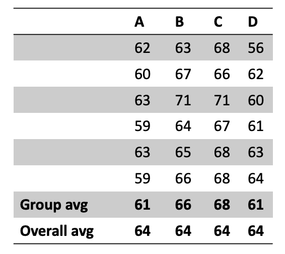

# ANalysis Of VAriance

ANOVA is a means of comparing different groups of measurement data to establish whether there is any difference between them.  The groupings may be a result of the same experiment for example undertaken on different days or similar experiments undertaken with a slightly different approach.

The figure below shows four different groups of data, labelled in the columns A, B, C and D.  The averages shown at the base of each column are the group and overall averages, top and bottom, respectively.

To calculate the test statistic that ultimately helps us to determine if the means are significantly different or not we need to calculate the various elements as shown in the table below. You can see there is an implied order since some of the calculations require others to be completed first.

In the first column the difference is taken between the individual result values, $y_{ti}$ and the overall average, $\bar{y}$. Each of these individual deviations are squared, summed and totalled at the bottom of the column.

In the second column a similar process is repeated but instead of individual result values, the difference between the overall treatment average, $y_{ti}$ and overall mean, $\bar{y}$ is calculated.  Again these are squared and summed.

In the last column the process is repeated but the sum of squared error calculated this time is that between the individual results, $y_{ti}$ and the treatment average, $\bar{y}_t$.

From the above you can see that the three columns represent the overall deviation, the deviation between groups and deviation within groups, respectively.

The ratio of the two mean squares, representing the variance between groups and within groups is taken to give the F-value.  This is described mathematically as follows;

$$ \frac{\text{Variance between groups}}{\text{Variance within groups}} = \frac{\sum({\bar{y}_t-\bar{y}})^2}{n-1}/\frac{\sum({\bar{y}_{ti}-\bar{y}_t})^2}{n-1} = 13.57 \nonumber$$

High F-values occur when the variance between groups is much higher than the variance within groups. It is therefore much less likely to be observed if the groups are the same i.e. the null hypothesis is true. Looking up the probability of us achieving an F-value of this magnitude assuming the null hypothesis is true, we can see it is highly unlikely that this F-value would occur i.e. the probability of it occurring is $6.73\times10^{-8}$!

Further Information: [Understanding Analysis of Variance (ANOVA) and the F-test](https://blog.minitab.com/en/adventures-in-statistics-2/understanding-analysis-of-variance-anova-and-the-f-test)
